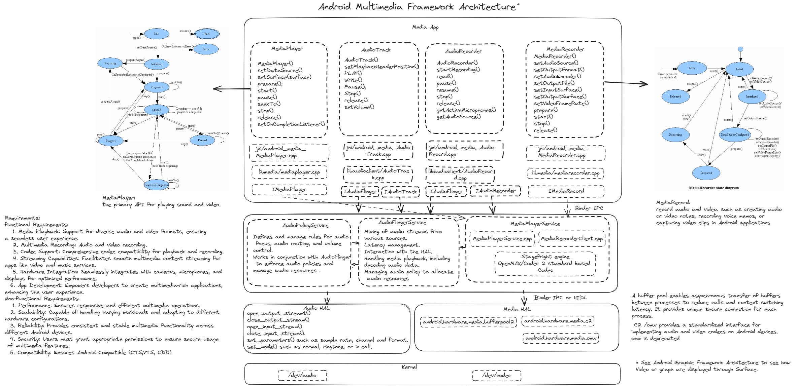

# Exploring the Depths: A Comprehensive Dive into Android Framework Architecture
This document serves as a comprehensive guide, delving into the intricate details of the key components of the Android system. By demystifying the fundamental principles inherent to the Android Framework System, it aims to empower readers with practical knowledge. Whether you're a seasoned developer or a job seeker preparing for interviews, the insights provided here are crafted to be both informative and highly applicable to your daily tasks. The purpose of this document is to  explore the inner workings of Android, unravel complexities, and gain a deeper understanding of the framework that powers millions of devices worldwide.  
The key components we are going to introduce include:
 - Android Inter-Process Communication (IPC):  
      Introducing IPC mechanisms in Linux and Android, addressing the limitations of traditional IPC methods and presenting the Binder IPC mechanism in Android, with a focus on its efficiency, security, and support for object-oriented communication..
- Android Security Framework:  
      Explore the robust security measures implemented in Android, covering aspects such as permission systems, secure booting, and protection against various threats, ensuring the integrity and confidentiality of the entire system.
- Android Multimedia Framework:  
      Delve into the core of multimedia handling in Android, including audio and video playback, recording, and the coordination of media-related functionalities across the framework, influencing both app and system behavior.
- Android Graphic Framework:  
      Discover the graphic rendering and display capabilities of Android, encompassing UI rendering, graphics acceleration, and the overall visual presentation of applications, extending its impact to the system's visual interface.
- Android Sensor Framework:  
      Learn about the integration and utilization of various sensors in Android devices, providing input for features like orientation, motion, and environmental sensing, influencing system-level decisions based on sensor data.
- Android Camera Framework:  
      Explore the functionalities and interfaces provided by Android for interacting with device cameras, enabling applications to capture photos and videos seamlessly, influencing both app-level and system-level image processing.
- Android Booting Process:  
      Gain insights into the system booting sequence of Android devices, understanding the initialization and loading of essential components during the startup, spanning across the bootloader, kernel, and system services.
- Android Connectivity Framework:  
      Explore the mechanisms that facilitate network connectivity, covering protocols, APIs, and the handling of various network types for communication, impacting system-level network management.
- Android Installation/Package Framework:  
      Understand the processes involved in installing, managing, and updating applications on Android devices, including package management and distribution, influencing both the app layer and the system layer.
- Android Activity Manager:  
      Learn about the Activity Manager, a crucial component for managing the lifecycle and execution of applications, ensuring efficient resource usage across the system.
- Android Runtime:  
      Delve into the Android Runtime (ART), the environment responsible for executing application code, and understand the optimizations and features it brings to app performance, impacting both app and system performance.
- Android WindowManager:  
      Explore the WindowManager, focusing on the management of display surfaces and windows, playing a key role in the visual presentation and interaction within the Android UI, impacting both app and system interfaces.
- Performance Optimization:  
      Explore how Android handles performance optimization, including techniques such as background process management, task scheduling, and resource allocation.
- Battery Usage and Power Management:  
      Delve into the mechanisms employed by Android to manage battery usage and power consumption. This could include details on power-saving modes, background app restrictions, and strategies for efficient power utilization.
- Resource Management:  
     Discuss how Android manages system resources such as memory, CPU, and storage. This could encompass topics like garbage collection, memory allocation, and file system management.
- Jetpack Compose
- 
(Note: This document is a work in progress and will be continually updated.)
##Android Inter-Process Communication (IPC)
IPC mechanisms that involves communication of one process with another process. In Linux, various IPC mechanisms are available, including Pipes, FIFO, Message Queues, Unix Sockets, Shared Memory, Semaphores, 
and Signals. These mechanisms offer valuable means of communication, they come with certain limitations:
- Functionality:
    The listed IPC mechanisms are primarily designed for local communication between processes on the same machine. However, they are not specialized for remote method calls and Object-Oriented Communication.
- Security:
    Fine-Grained Security Controls: The listed IPC mechanisms lack fine-grained security controls, making it challenging to regulate access to shared resources.
Access Regulation: They may not provide effective mechanisms to regulate which processes can access shared resources, potentially leading to security vulnerabilities.
Permissions Management: The listed IPC mechanisms may not manage permissions effectively, raising concerns about data security and unauthorized access.
Security issues may lead to data leakage or deadlock, especially when using semaphore mechanisms. For preinstalled apps or daemons, a viable solution is to utilize SELinux, ensuring that specific apps can access designated IPC mechanisms, safeguarding app data. However, for regular apps running in an untrusted app domain, SELinux may face limitations in distinguishing between them.
To address these challenges, the Android system provides the Binder IPC mechanism. We will introduce widely used IPC mechanisms in Android, including Unix Sockets, Shared Memory, and Binder IPC.
### SharedMemory
    Shared memory facilitates fast and efficient communication between processes, enabling direct data sharing without the overhead of copying. It provides low-latency, high-performance communication, making it suitable for scenarios involving frequent and large data transfers. The memory-mapped nature of shared memory simplifies data manipulation and enhances memory efficiency, allowing processes to access shared data as if it were regular memory. To ensure proper concurrency and avoid race conditions when accessing shared memory, synchronization mechanisms like semaphores are required. 
#### Shared Memory example code
See example code for creating shared memory, accesimg memory and semaphores based synchronization mechanisms below:
Program A
```c
int main() {
    size_t size = sizeof(int);
    const char *filename = "/tmp/shared_memory_example";
    const char *writeSemaphoreName = "/shared_write_semaphore_example";
    // Open the existing file
    int fd = open(filename, O_RDWR);
    if (fd == -1) {
        perror("open");
        exit(1);
    }
    // Map the file into memory
    int *data = mmap(NULL, size, PROT_READ | PROT_WRITE, MAP_SHARED, fd, 0);
    if (data == MAP_FAILED) {
        perror("mmap");
        exit(1);
    }
    // Open the existing write semaphore
    sem_t *writeSem = sem_open(writeSemaphoreName, 0);
    if (writeSem == SEM_FAILED) {
        perror("sem_open");
        exit(1);
    }
    // Write to shared memory
    sem_wait(writeSem);  // Wait for write semaphore
    *data =100;
    printf("Write Process wrote to shared memory: %d\n", *data);
    sem_post(writeSem);  // Release write semaphore

    // Cleanup
    sem_close(writeSem);
    munmap(data, size);
    close(fd);
    return 0;
}
```
Program B
```c
int main() {
    size_t size = sizeof(int);
    const char *filename = "/tmp/shared_memory_example";
    const char *readSemaphoreName = "/shared_read_semaphore_example";
    // Open the existing file
    int fd = open(filename, O_RDWR);
    if (fd == -1) {
        perror("open");
        exit(1);
    }
    // Map the file into memory
    int *data = mmap(NULL, size, PROT_READ | PROT_WRITE, MAP_SHARED, fd, 0);
    if (data == MAP_FAILED) {
        perror("mmap");
        exit(1);
    }
    // Open the existing read semaphore
    sem_t *readSem = sem_open(readSemaphoreName, 0);
    if (readSem == SEM_FAILED) {
        perror("sem_open");
        exit(1);
    }
    // Read from shared memory
    sem_wait(readSem);  // Wait for read semaphore
    printf("Read Process read from shared memory: %d\n", *data);
    sem_post(readSem);  // Release read semaphore
    // Cleanup
    sem_close(readSem);
    munmap(data, size);
    close(fd);

    return 0;
}
```c
In this example, Program A writes to shared memory, and Program B reads from shared memory. Both programs use semaphores for synchronization. 


