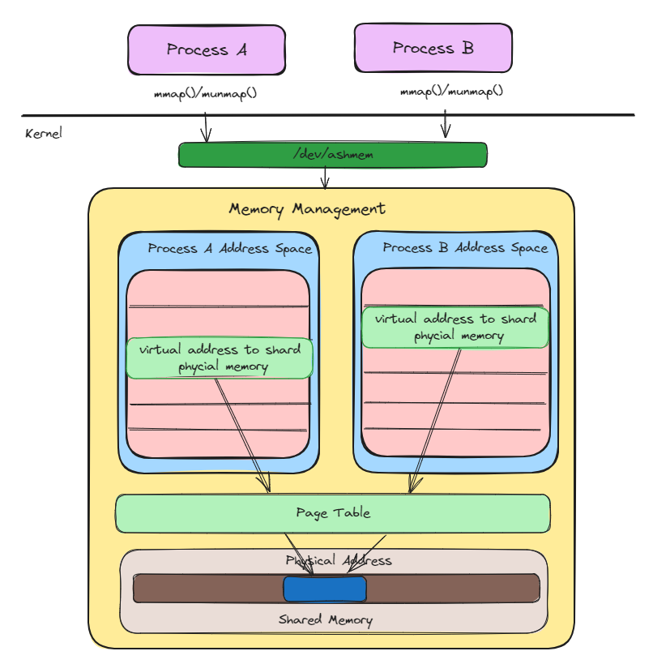
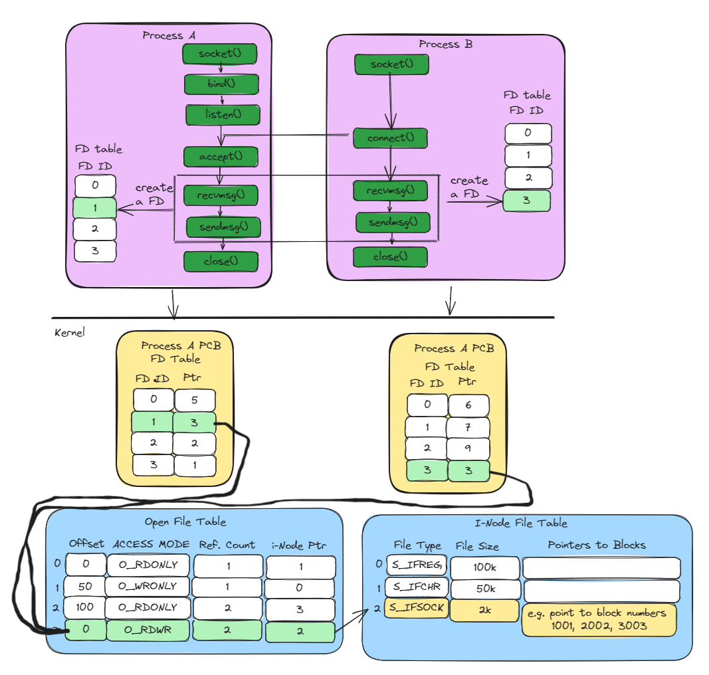
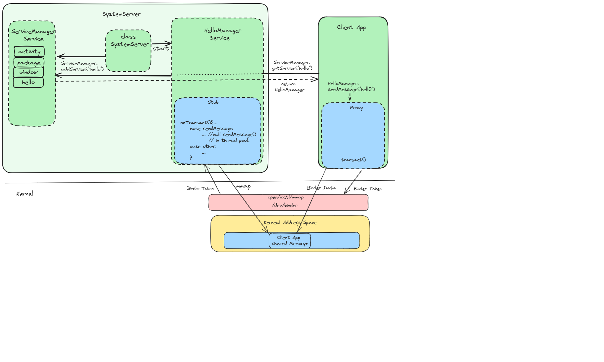
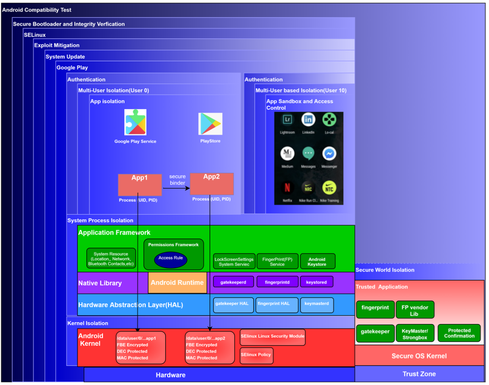
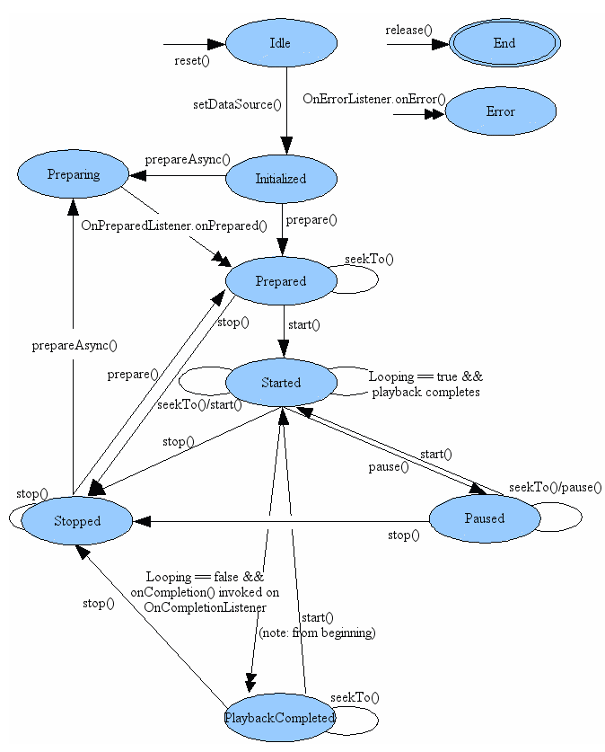
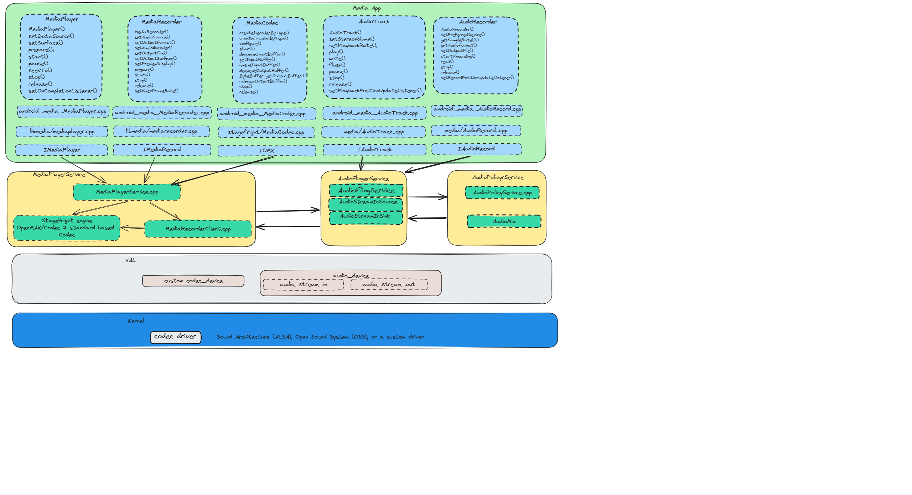

# Exploring the Depths: A Comprehensive Dive into Android Framework Architecture
This document serves as a comprehensive guide, delving into the details of the key components of the Android system. By explaining the fundamental principles inherent to the Android Framework System, it aims to empower readers with practical knowledge. Whether you're a seasoned developer or a job seeker preparing for interviews, the document provided here is crafted to be both informative and highly applicable to your daily tasks. The purpose of this document is to explore the inner workings of Android, unravel complexities, and gain a deeper understanding of the Android framework."
The key components we are going to introduce include:

[- Android Inter-Process Communication (IPC):](#a)

Introducing IPC mechanisms in Linux and Android, this section addresses the limitations of traditional IPC methods and presents the Binder IPC mechanism, with a focus on its efficiency, security, and support for object-oriented communication. Additionally, the section covers widely used IPC mechanisms in the Android system, including Shared Memory and Unix Domain Socket.
      
[- Android Security Model Analysis:](#b)

Delve into Android's Security Model, examining multi-party consent, compatibility requirements, and robust defense mechanisms. Explore layers like Secure Bootloader, SELinux, and comprehensive protection strategies, ensuring integrity, adaptability, and secure user experiences.

[- Android Multimedia framework: ](#c) 

Delve into the core of multimedia handling in Android, including audio and video playback, recording, and the coordination of media-related functionalities across the framework, influencing both app and system behavior.

- Android Graphic Framework:  
Discover the graphic rendering and display capabilities of Android, encompassing UI rendering, graphics acceleration, and the overall visual presentation of applications, extending its impact to the system's visual interface.
- Android Sensor Framework:  
Learn about the integration and utilization of various sensors in Android devices, providing input for features like orientation, motion, and environmental sensing, influencing system-level decisions based on sensor data.
- Android Camera Framework:  
Explore the functionalities and interfaces provided by Android for interacting with device cameras, enabling applications to capture photos and videos seamlessly, influencing both app-level and system-level image processing.
- Android Booting Process:  
Gain insights into the system booting sequence of Android devices, understanding the initialization and loading of essential components during the startup, spanning across the bootloader, kernel, and system services.
- Android Connectivity Framework:  
Explore the mechanisms that facilitate network connectivity, covering protocols, APIs, and the handling of various network types for communication, impacting system-level network management.
- Android Installation/Package Framework:  
Understand the processes involved in installing, managing, and updating applications on Android devices, including package management and distribution, influencing both the app layer and the system layer.
- Android Activity Manager:  
Learn about the Activity Manager, a crucial component for managing the lifecycle and execution of applications, ensuring efficient resource usage across the system.
- Android Runtime:  
Delve into the Android Runtime (ART), the environment responsible for executing application code, and understand the optimizations and features it brings to app performance, impacting both app and system performance.
- Android WindowManager:  
Explore the WindowManager, focusing on the management of display surfaces and windows, playing a key role in the visual presentation and interaction within the Android UI, impacting both app and system interfaces.
- Performance Optimization:  
Explore how Android handles performance optimization, including techniques such as background process management, task scheduling, and resource allocation.
- Battery Usage and Power Management:  
 Delve into the mechanisms employed by Android to manage battery usage and power consumption. This could include details on power-saving modes, background app restrictions, and strategies for efficient power utilization.
- Resource Management:  
Discuss how Android manages system resources such as memory, CPU, and storage. This could encompass topics like garbage collection, memory allocation, and file system management.
- Jetpack Compose
- Coroutine
- ViewModel
(Note: This document is a work in progress and will be continually updated.)

 <a name="a"></a>
 
## 1 Android Inter-Process Communication (IPC)

IPC mechanisms that involves communication of one process with another process. In Linux, various IPC mechanisms are available, including Pipes, FIFO, Message Queues, Unix Domain Sockets, Shared Memory, Semaphores, 
and Signals. These mechanisms offer valuable means of communication, they come with certain limitations:

- **Functionality:**
    The listed IPC mechanisms are primarily designed for local communication between processes on the same machine. However, they are not specialized for remote method calls and Object-Oriented Communication.
  
- **Security:**
    - *Fine-Grained Security Controls:* The listed IPC mechanisms lack fine-grained security controls, making it challenging to regulate access to shared resources.
    - *Access Regulation:* They may not provide effective mechanisms to regulate which processes can access shared resources, potentially leading to security vulnerabilities.
    - *Permissions Management:* The listed IPC mechanisms may not manage permissions effectively, raising concerns about data security and unauthorized access.

Security issues may lead to data leakage or deadlock. For preinstalled apps or daemons, a viable solution is to utilize SELinux, ensuring that specific apps can access designated IPC mechanisms, safeguarding app data. However, for regular apps running in an untrusted app domain, SELinux may face limitations in distinguishing between them.

To address these challenges, the Android system provides the Binder IPC mechanism. We will introduce widely used IPC mechanisms in Android, including Unix Sockets, Shared Memory, and Binder IPC.
### 1.1 SharedMemory
Shared memory facilitates fast and efficient communication between processes, enabling direct data sharing without the overhead of copying. It provides low-latency, high-performance communication, making it suitable for scenarios involving frequent and large data transfers. The memory-mapped nature of shared memory simplifies data manipulation and enhances memory efficiency, allowing processes to access shared data as if it were regular memory. To ensure proper concurrency and avoid race conditions when accessing shared memory, synchronization mechanisms like semaphores are required. 

#### 1.1.1 Shared Memory Design Diagram
The shared memory has the following lifecycle:
- Processes in user space use the mmap system call to map a portion of virtual memory into their respective address spaces, creating a shared memory region.
- When a process calls mmap, the /dev/ashmem driver, acting as an intermediary between user space and the kernel, facilitates communication with the kernel's memory management module.
- The kernel's memory management module interacts with the page table to map the requested virtual memory region to physical memory, ensuring accessibility for the processes. 
- With the memory successfully mapped, processes can read from or write to the shared memory region. Synchronization mechanisms like semaphores may be employed to coordinate access.
- When processes are done with the shared memory, they use the munmap system call to unmap the memory.
- During the memory mapping process, the page table is updated to reflect the mapping of virtual memory to physical memory, ensuring proper address translation for subsequent access.

  See shared memory Design diagram below for more information:




#### 1.1.2 Shared Memory example code
See example code for creating shared memory, accesimg memory and semaphores based synchronization mechanisms below:

Program A

```c
#define SHARED_MEMORY_SIZE 1024
#define SEMAPHORE_NAME "/my_semaphore"
int main() {
    int fd;
    void *shared_memory;
    sem_t *semaphore;
    // Open the /dev/ashmem device file
    fd = open("/dev/ashmem", O_RDWR);
    if (fd < 0) {
        perror("Error opening /dev/ashmem");
        return 1;
    }
    // Set the size of the shared memory region
    ioctl(fd, ASHMEM_SET_SIZE, SHARED_MEMORY_SIZE);
    // Map the shared memory region into the process address space
    shared_memory = mmap(NULL, SHARED_MEMORY_SIZE, PROT_READ | PROT_WRITE, MAP_SHARED, fd, 0);
    // Create or open the semaphore
    semaphore = sem_open(SEMAPHORE_NAME, O_CREAT, 0666, 1);
    if (semaphore == SEM_FAILED) {
        perror("Error creating/opening semaphore");
        return 1;
    }
    // Write data to shared memory
    strcpy((char *)shared_memory, "Hello, Shared Memory!");
    // Post the semaphore to signal completion of writing
    sem_post(semaphore);
    // Clean up
    munmap(shared_memory, SHARED_MEMORY_SIZE);
    close(fd);
    sem_close(semaphore);
    return 0;
}
```

Program B

```c
#define SHARED_MEMORY_SIZE 1024
#define SEMAPHORE_NAME "/my_semaphore"

int main() {
    int fd;
    void *shared_memory;
    sem_t *semaphore;
    // Open the /dev/ashmem device file
    fd = open("/dev/ashmem", O_RDWR);
    if (fd < 0) {
        perror("Error opening /dev/ashmem");
        return 1;
    }
    // Set the size of the shared memory region
    ioctl(fd, ASHMEM_SET_SIZE, SHARED_MEMORY_SIZE);
    // Map the shared memory region into the process address space
    shared_memory = mmap(NULL, SHARED_MEMORY_SIZE, PROT_READ | PROT_WRITE, MAP_SHARED, fd, 0);
    // Create or open the semaphore
    semaphore = sem_open(SEMAPHORE_NAME, O_CREAT, 0666, 1);
    if (semaphore == SEM_FAILED) {
        perror("Error creating/opening semaphore");
        return 1;
    }
    // Wait on the semaphore before reading from shared memory
    sem_wait(semaphore);
    // Read and print data from shared memory
    printf("Reader process read from shared memory: %s\n", (char *)shared_memory);
    // Clean up
    munmap(shared_memory, SHARED_MEMORY_SIZE);
    close(fd);
    sem_close(semaphore);
    return 0;
}
```
In this example, Program A writes to shared memory, and Program B reads from shared memory. Both programs use semaphores for synchronization. 


### 1.2 Unix Domain Socket(UDS)
UDS facilitate efficient and bidirectional communication between processes on the same host, operating locally for minimal latency and enhanced performance. UDS supports zero-copy mechanisms, pointing processes to the same file descriptor in the global file table, reducing data duplication during exchange. Through access modes that define permissions, UDS offer a secure and reliable means for seamless collaboration among local processes.
Unix Domain Sockets (UDS) play a crucial role in the Android system. For instance, Android utilizes BitTube mechanism whcih is based on UDS to transmit VSYNC information from the Hardware Abstraction Layer (HAL) to SurfaceFlinger, as well as from SurfaceFlinger to the calling applications. This demonstrates the versatility and significance of UDS in facilitating inter-process communication within the Android framework.

#### 1.2.1 UDS Design Diagram
In the Unix Domain Socket (UDS) design diagram below, the workflow includes the following steps:
   - Socket Creation: Use socket() to create a socket.
   - Binding: Use bind() to associate the socket with a specific local address or file name.
   - Listening: Call listen() to transition the socket into the listening state, allowing it to accept incoming connections.
   - Accept: Call accept() to create an incoming connection on a listening socket, obtaining a new file descriptor. Synchronize with the client to ensure both server and client file descriptors point to the same file description in the open file description table.
   - Connection Establishment: Call connect() to establish a connection with the server. Synchronize with the server to make its file descriptor point to the same file description in the open file description table.
   - Data Transfer: Use send() and recv() for communication. The file descriptors in both client and server point to the same file description in the open file description table, facilitating zero-copy operations.
   - Socket Closure: Call close() to remove entries from the process FD table and the system open FD table.
This workflow ensures a seamless and synchronized interaction between the server and client, leveraging shared file descriptors for efficient data transfer and maintaining proper cleanup procedures during socket closure.



#### 1.2.2 UDS Sample Code
Server Program

```c

#define SOCKET_PATH "/tmp/example_socket"
void error(const char *msg) {
    perror(msg);
    exit(EXIT_FAILURE);
}
int main() {
      /*Create a Unix domain socket
       SOCK_SEQPACKET is a socket type that provides a reliable, connection-oriented, and sequenced
      communication channel. It preserves message boundaries and delivers data as a sequence of
       complete packets.*/
    int sockfd = socket(AF_UNIX, SOCK_SEQPACKET, 0);
    if (sockfd == -1) {
        error("Error creating socket");
    }
    struct sockaddr_un addr;
    addr.sun_family = AF_UNIX;
    strncpy(addr.sun_path, SOCKET_PATH, sizeof(addr.sun_path) - 1);
    // Bind the socket to a file path
    if (bind(sockfd, (struct sockaddr*)&addr, sizeof(addr)) == -1) {
        error("Error binding socket");
    }
    // Listen for connections
    if (listen(sockfd, 5) == -1) {
        error("Error listening for connections");
    }
    printf("Server is listening on %s\n", SOCKET_PATH);
    while (1) {
        // Accept incoming connections
        int clientfd = accept(sockfd, NULL, NULL);
        if (clientfd == -1) {
            error("Error accepting connection");
        }
        printf("Received a connection from a client\n");
        // Send multiple messages to the client
        for (int i = 1; i <= 3; ++i) {
            char message[20];
            snprintf(message, sizeof(message), "Message %d", i);
            // Send the message
            if (send(clientfd, message, sizeof(message), 0) == -1) {
                error("Error sending message");
            }
            printf("Sent: %s\n", message);
        }
        // Close the connection
        close(clientfd);
        printf("Connection closed\n");
    }
    // Close the server socket
    close(sockfd);
    // Remove the socket file
    unlink(SOCKET_PATH);
    return 0;
}
```
Client Program

```c

#define SOCKET_PATH "/tmp/example_socket"
void error(const char *msg) {
    perror(msg);
    exit(EXIT_FAILURE);
}
int main() {
    // Create a Unix domain socket
    int sockfd = socket(AF_UNIX, SOCK_SEQPACKET, 0);
    if (sockfd == -1) {
        error("Error creating socket");
    }
    struct sockaddr_un addr;
    addr.sun_family = AF_UNIX;
    strncpy(addr.sun_path, SOCKET_PATH, sizeof(addr.sun_path) - 1);
    // Connect to the server
    if (connect(sockfd, (struct sockaddr*)&addr, sizeof(addr)) == -1) {
        error("Error connecting to the server");
    }
    printf("Connected to the server\n");
    // Receive messages from the server
    for (int i = 1; i <= 3; ++i) {
        char message[20];
        ssize_t bytesRead = recv(sockfd, message, sizeof(message), 0);
        if (bytesRead == -1) {
            error("Error receiving message");
        } else if (bytesRead == 0) {
            printf("Server closed the connection\n");
            break;
        } else {
            printf("Received: %s\n", message);
        }
    }
    // Close the client socket
    close(sockfd);
    return 0;
}
```

### 1.3 Binder IPC
Binder IPC is a key mechanism in the Android system, enabling efficient communication among different components. It overcomes limitations found in traditional IPC methods, focusing on efficiency with shared memory supported, security, and support for object-oriented communication. The Binder IPC allows seamless exchange of data and messages between applications, services, and the Android system and HAL layer , ensuring optimal resource utilization. Its fine-grained security controls provide precise access regulation to shared resources, enhancing overall system security. With its integral role in Android's architecture, a solid understanding of Binder IPC is essential for developers to craft robust and high-performance applications. 
#### 1.3.1 Binder IPC Design Diagram
This design diagram below outlines the key steps involved in Binder IPC with a System Service, highlighting the interactions between different components. The workflow includes:
 - Define Binder Interface:
Define the Binder interface through an AIDL (Android Interface Definition Language) file, specifying the methods that will be remotely accessible.

 - Implement Binder Interface:
Implement the Binder interface in the System Service Stub, providing the concrete implementation for each method defined in the interface.

 - Register with Service Manager:
Register the System Service with the Service Manager by calling ServiceManager.addService(service) as soon as the System Server is launched. This step allows clients to discover and access the System Service.
 - Allocate Shared Memory for Binder IPC:
Allocate approximately 1 megabyte of shared memory for Binder IPC. This shared memory facilitates efficient data exchange between the client app and the System Service.

 - Client App Interaction:
The client app calls ServiceManager.getService() to obtain an instance of the System Service, allowing access to its remote functions.

- Remote Function Invocation:
Utilize the System Service instance in the client app to invoke remote functions defined in the Binder interface. This initiates the communication between the client app and the System Service.
 - Data Serialization:
Serialize the data related to the method call in the client app. This serialized data is then placed into the shared memory allocated for Binder IPC.
 - /dev/binder Driver Interaction:
The /dev/binder driver, a key component of Binder IPC, maps a portion of the System Server's memory to the shared memory in the client app. This mapping facilitates efficient data transfer.
 - Call Method in System Service:
Upon completing its tasks, the /dev/binder driver triggers the onTransaction() method in the System Service. This method handles deserialization, selects a thread from the thread pool, and calls the corresponding function requested by the client app.
This comprehensive workflow ensures seamless and efficient communication between the client app and the System Service using Binder IPC, leveraging shared memory and the essential components of the Binder framework.
\   


#### 1.3.2 Binder IPC Sample Code:
In Section 1.3.1, we focused on system service discussion. For application service, the logic is similar to the system service. However, we use bindService() and onConnection() mechanisms to find the service, rather than ServiceManager used by the system service. To see example code on how a client interacts with the application service, refer to the code snippet below:

 - AIDL interface (IRemoteService.aidl):

```c

interface IRemoteService {
    void sendMessage(String message);
}
```

 - Tthe Application Service (RemoteService.java):

```c
public class RemoteService extends Service {
    
    private final IBinder binder = new RemoteBinder();

    @Nullable
    @Override
    public IBinder onBind(Intent intent) {
        return binder;
    }

    public class RemoteBinder extends Binder implements IRemoteService {
        @Override
        public void sendMessage(String message) {
            // Handle the received message
            Log.d("RemoteService", "Received message: " + message);
        }
    }
}

```

 - AndroidManifest file in Application Server
```c
<!-- AndroidManifest.xml -->
<service
    android:name=".MyService"
    android:enabled="true"
    android:exported="true">
</service>
```

 - The client application implemetation :
```c
// MainActivity.java
public class MainActivity extends AppCompatActivity {

    private IRemoteService remoteService;
    @Override
    protected void onCreate(Bundle savedInstanceState) {
        super.onCreate(savedInstanceState);
        setContentView(R.layout.activity_main);
        // Bind to the remote service
        Intent intent = new Intent(this, RemoteService.class);
        bindService(intent, serviceConnection, Context.BIND_AUTO_CREATE);
        // Register a click listener for the button
        Button sendMessageButton = findViewById(R.id.sendMessageButton);
        sendMessageButton.setOnClickListener(new View.OnClickListener() {
            @Override
            public void onClick(View view) {
                sendMessageToRemoteService();
            }
        });
    }
    private ServiceConnection serviceConnection = new ServiceConnection() {
        @Override
        public void onServiceConnected(ComponentName componentName, IBinder iBinder) {
            remoteService = IRemoteService.Stub.asInterface(iBinder);
        }

        @Override
        public void onServiceDisconnected(ComponentName componentName) {
            remoteService = null;
        }
    };

    private void sendMessageToRemoteService() {
        if (remoteService != null) {
            try {
                remoteService.sendMessage("Hello from client!");
            } catch (RemoteException e) {
                e.printStackTrace();
            }
        } else {
            // Handle the case where the service is not connected
            Toast.makeText(this, "Service not connected", Toast.LENGTH_SHORT).show();
        }
    }
}
```
 <a name="b"></a>

## 2 Android Security Model Analysis

In the constantly changing world of mobile technology, the Android Security Model serves as a strong defense, protecting user data, system integrity, and overall device security. This comprehensive security framework includes different layers of protection to address various threats. Let's explore specific threat models,security model and how Android enhances its security.

- Threat Model:
   - Hacker can get physical access to Android devices.
   - Network communication is untrusted 
   - Untrusted code is executed on the device. (Device Image, bootloader, kernel, daemon, system server, app)
   - Privacy protection for Mutiple party computationer experience.

- Security Model:
  - Multi-party consent: No action should be executed unless all main parties agree — in the standard case, these are user, platform, and developer.
  - Security is a compatibility requirement. Devices that do not conform to CDD and do not pass CTS are not Android compatiable devices. 
  - Factory reset restores the device to a safe state. 
  - Applications are security principals. T

- Security Model design
    Android's architecture is designed with multiple layers of security to provide a robust and comprehensive defense against various threats. The advantages of having multiple layers of security in Android include:
     - Defense in Depth:
Android employs a defense-in-depth strategy by implementing security measures at multiple layers. This means that if one layer is compromised, there are additional layers of protection to prevent further exploitation.
    - Comprehensive Protection:
Each security layer in Android addresses specific aspects of security, such as access control, data encryption, network security, and more. This comprehensive approach ensures that various attack vectors are covered.
    - Isolation of Components:
Different layers in Android are designed to operate independently and are isolated from each other.
    - Adaptability to Evolving Threats:
The use of multiple security layers allows Android to adapt to evolving security threats. As new threats emerge, Android's architecture can be updated to incorporate additional security measures without disrupting the entire system.

Android's security architecture includes the following features:
- Android Compatibility Test: Ensures that Android devices meet compatibility standards, providing a consistent and secure user experience. Devices that pass the compatibility test can reliably run Android applications.
- Secure Bootloader and Integrity Verification: The bootloader ensures the integrity of the device's boot process. It verifies the authenticity and integrity of each component loaded during the boot sequence, preventing the execution of tampered or unauthorized code.
- SELinux (Security-Enhanced Linux): Provides fine-grained access control to regulate interactions between processes and the Android system. SELinux enhances security by enforcing mandatory access controls and preventing unauthorized actions.
- Exploit Mitigation: Incorporates techniques like Address Space Layout Randomization (ASLR) and Data Execution Prevention (DEP) to mitigate common exploit methods. These techniques make it more challenging for attackers to exploit vulnerabilities.
- System Update: Regular updates are provided to patch vulnerabilities and enhance the overall security posture of Android devices. These updates address known vulnerabilities and introduce new security features.
- Google Play: Ensures the security of apps distributed through the platform, protecting users from malicious applications. Apps undergo a vetting process before being made available on Google Play.
- Authentication: Enforces strong authentication methods, including PINs, passwords, biometrics (fingerprint, face recognition), and device-based authentication.
- Multiple User Isolation: Supports multiple user profiles on a single device, ensuring isolation between user accounts. Each user has their own set of apps, settings, and data, enhancing privacy and security.
- App Isolation: Ensures that apps operate in isolated environments, preventing unauthorized access to sensitive data. Each app runs independently, and its interactions with the system and other apps are restricted.
- Permission Framework: Apps request specific permissions to access certain device resources. Users can grant or deny these permissions, providing control over app capabilities and enhancing user privacy.
- TrustZone Root of Trust: TrustZone technology establishes a secure execution environment separate from the normal operating system. It enhances the security of critical functions and protects sensitive operations.
- File-Based Encryption (FBE): Devices using FBE offer two kinds of storage locations to apps:
   - Device Encrypted (DE) storage is available once the device boots, before the user unlocks thedevice. This storage is protected by a hardware secret and software running in the TEE that checks that Verified Boot is successful before decrypting data.
   - Credential Encrypted (CE) storage is available only after the user has unlocked the device. In addition to the protections on DE storage, CE storage keys can only be derived after unlocking the device, with protection against brute force attacks in hardware.

Google Private Computer Core also provide following mechanism:
- App Sandbox:  Apps operate within sandboxed environments, isolating them from apps outside of sanbox to protect user privacy when the app invloves mutiple party computation sucha as Federal AI or mutiple party computuaion.

See more information below about Android Security Model analysis.



 <a name="c"></a>
 
## 3 Android Multimedia framework
The Android Multimedia Framework provides a comprehensive solution for handling multimedia content on Android devices. It encompasses various components and APIs that facilitate the playback, recording, and manipulation of audio and video content. The framework ensures a seamless multimedia experience for users and serves as a foundation for multimedia applications.

Key Components:
- Audio Track / Media Player API
   - Allows developers to integrate audio / video playback functionality into applications.
   - Supports various audio/media formats and streaming protocols.
   - Provides methods for controlling playback, such as play, pause, stop, and seek.
See the Media Player state diagram below to understand how to use the Media Player API.


   
- AudioRecord/ Media Recorder API
  
   - Enables the recording of audio / video from device microphones and cameras.
   - Supports different recording sources and output formats.
   - Offers functionalities for starting, stopping, and managing the recording process.
See the Media Recorder state diagram below to understand how to use the Media Recorder API.



- MediaCodec API

  - Encoding and Decoding: Allows developers to encode and decode multimedia content, leveraging its capabilities to efficiently process different types of data including compressed data, raw audio, and raw video.
  - Surface Integration: For optimal performance with raw video data, MediaCodec recommends using a Surface. This integration is particularly beneficial for seamless interaction with Android graphic framework, enhancing overall efficiency in multimedia processing.
See the MediaCodec state diagram and sample code below to understand how to use the Media MediaCodec API.

```c

public class MediaCodecExample {

    // Encoder configuration
    private static final String MIME_TYPE = "video/avc";
    private static final int WIDTH = 640;
    private static final int HEIGHT = 480;
    private static final int FRAME_RATE = 30;
    private static final int I_FRAME_INTERVAL = 5;
    private static final int BIT_RATE = 500000; // 500 kbps

    // Decoder configuration
    private static final int TIMEOUT_US = 10000;

    public void encodeDecodeVideo() {
        try {
            // Step 1: Create encoder and decoder instances
            MediaCodec encoder = createEncoder();
            MediaCodec decoder = createDecoder();

            // Step 2: Start encoder and decoder
            encoder.start();
            decoder.start();

            // Step 3: Feed input data to encoder
            FileInputStream inputStream = new FileInputStream("path/to/your/video/file");
            ByteBuffer[] inputBuffers = encoder.getInputBuffers();

            while (true) {
                int inputBufferIndex = encoder.dequeueInputBuffer(TIMEOUT_US);
                if (inputBufferIndex >= 0) {
                    ByteBuffer inputBuffer = inputBuffers[inputBufferIndex];
                    inputBuffer.clear();

                    // Read data from file to inputBuffer
                    int bytesRead = inputStream.read(inputBuffer.array());
                    if (bytesRead == -1) {
                        // End of file, signal end of input
                        encoder.queueInputBuffer(inputBufferIndex, 0, 0, 0, MediaCodec.BUFFER_FLAG_END_OF_STREAM);
                        break;  // Exit the loop when end of file is reached
                    } else {
                        // Queue input buffer for encoding
                        encoder.queueInputBuffer(inputBufferIndex, 0, bytesRead, 0, 0);
                    }
                }
            }

            // Rest of the code remains the same

            // Step 5: Stop and release resources
            encoder.stop();
            encoder.release();
            decoder.stop();
            decoder.release();
            inputStream.close();

        } catch (IOException e) {
            e.printStackTrace();
        }
    }

    private MediaCodec createEncoder() throws IOException {
        MediaCodec encoder = MediaCodec.createEncoderByType(MIME_TYPE);
        MediaFormat format = MediaFormat.createVideoFormat(MIME_TYPE, WIDTH, HEIGHT);
        format.setInteger(MediaFormat.KEY_BIT_RATE, BIT_RATE);
        format.setInteger(MediaFormat.KEY_FRAME_RATE, FRAME_RATE);
        format.setInteger(MediaFormat.KEY_I_FRAME_INTERVAL, I_FRAME_INTERVAL);
        encoder.configure(format, null, null, MediaCodec.CONFIGURE_FLAG_ENCODE);
        return encoder;
    }

    private MediaCodec createDecoder() throws IOException {
        MediaCodec decoder = MediaCodec.createDecoderByType(MIME_TYPE);
        MediaFormat format = MediaFormat.createVideoFormat(MIME_TYPE, WIDTH, HEIGHT);
        decoder.configure(format, null, null, 0);
        return decoder;
     }
}

```

- MediaPlayerService
  - Audio/Video Playback: The service handles the playback of audio and video content, supporting a variety of formats and streaming protocols.
  - Audio/Video Recording: MediaPlayerService supports recording audio and video from device microphones and cameras, providing functionalities for starting, stopping, and managing the recording process.
  - Playback Control: Offers methods for controlling playback, including play, pause, stop, seek, and volume adjustments.
  - Media Session Management: Manages media sessions, allowing multiple apps to interact with media playback and recording simultaneously.
  - Audio Focus Handling: Coordinates with the audio framework to manage audio focus, ensuring a seamless experience when multiple apps request audio resources.
  - Integration with Audio Framework: MediaPlayerService integrates with the underlying audio framework, allowing efficient and low-level control over audio playback and recording.

- AudioFlingerService
  - Audio Mixing: AudioFlingerService combines multiple audio streams from different applications and services, ensuring seamless playback.
  - Hardware Abstraction: Interacts with the Audio Hardware Abstraction Layer (Audio HAL) to communicate with the underlying audio hardwar.
  - Audio Routing: Directs audio streams to the appropriate output sources, such as speakers, headphones, or Bluetooth devices.
  - Integration with Audio Policy: Collaborates with AudioPolicyService to enforce audio policies and ensure consistent audio behavior across the system.
   
- AudioPolicyService
  - Audio Routing Policies: AudioPolicyService defines policies for routing audio streams to various outputs, considering factors like device capabilities and user preferences.
  - Dynamic Audio Routing: Handles dynamic changes in audio routing based on events such as device connections or disconnections and adapts the audio policy accordingly.
  - Audio Stream Management: Categorizes audio streams into different types and applies specific policies for each type, ensuring a balanced and user-friendly audio experience.
  - Policy Enforcement: Enforces policies related to volume levels, audio effects, and other audio parameters, ensuring consistency and compliance with user preferences.
  - Integration with AudioFlinger: Works closely with AudioFlingerService to implement the defined audio policies and communicate them to the underlying audio hardware through the Audio HAL.

For details about video display, please refer to the Graphics Framework section.
See detail information about Android Multimedia Framework below:


