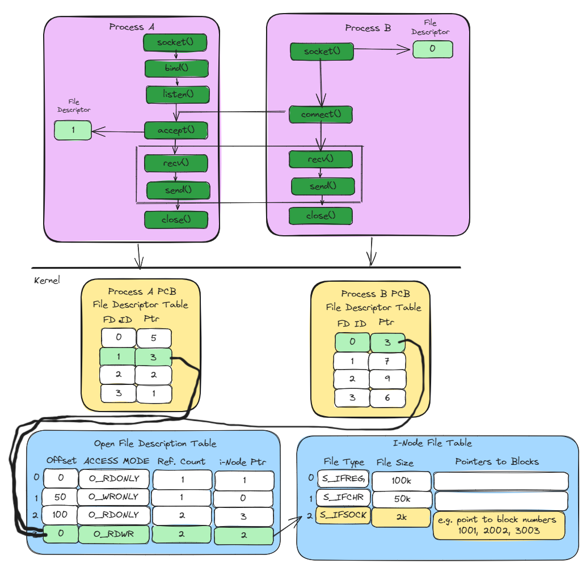
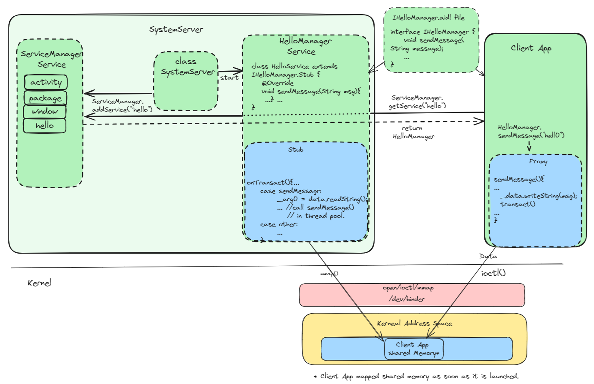
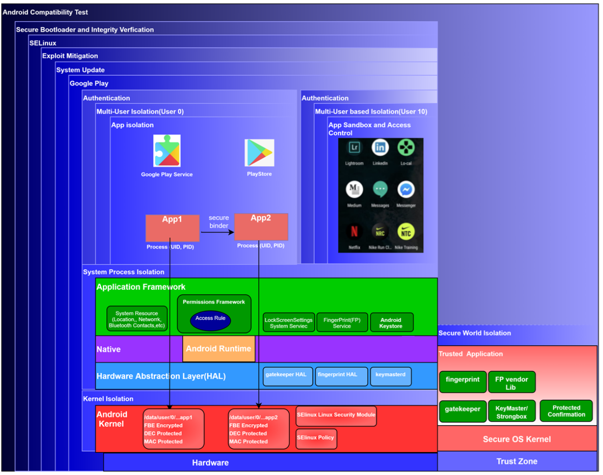
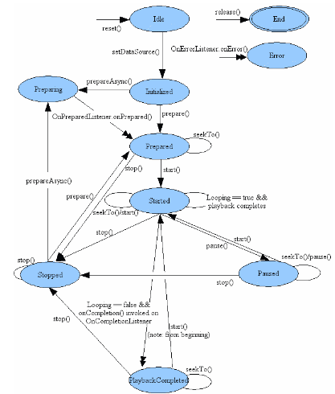
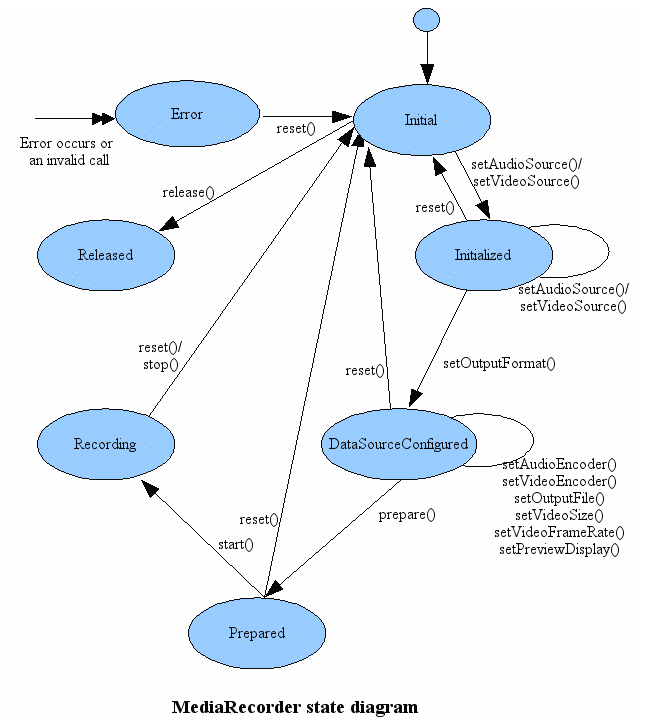

# Exploring the Depths: A Comprehensive Dive into Android Framework Architecture
**by [Jinlin Xu]**

This document serves as a comprehensive guide, delving into the details of the key components of the Android system. By explaining the fundamental principles inherent to the Android Framework System, it is designed to provide practical knowledge. Whether you're a seasoned developer, a job seeker preparing for Android domain knowledge or system design interviews, this document is crafted to be both informative and highly applicable to your daily tasks. The purpose of this document is to explore the inner workings of Android, break down complexities, and gain a deeper understanding of the Android framework.
The key components we are going to introduce include:

[- Android Inter-Process Communication (IPC):](#a)

  - [Shared Memory](#a1)

  - [Unix Domain Socket](#a2)

  - [Binder IPC](#a3)
      
[- Android Security Model Analysis:](#b)

[- Android Multimedia framework: ](#c) 

[- Android Graphic framework: ](#d) 

[- Android Camera Framework:](#e)  

[- Android Sensor Framework:](#f)  

(Note: This document is a work in progress and will be continually updated. In the future, it will include detailed information on Android Booting Process, Android Connectivity Framework, Android Installation/Package Framework, Android Activity Manager, Android Runtime, Android WindowManager, Performance Optimization, Battery Usage and Power Management, Resource Management, Jetpack Compose, Coroutine, ViewModel, and more )

 <a name="a"></a>
 
## 1 Android Inter-Process Communication (IPC)

IPC mechanisms involve the communication of one process with another process. In Linux, various IPC mechanisms are available, including the tranditional IPC mechanisms such as Pipes, FIFO, Message Queues, Unix Domain Sockets, Shared Memory, Semaphores, and Signals. These mechanisms offer valuable means of communication between processes; however, they come with certain limitations:

- **Functionality:**
    The tranditional IPC mechanisms are primarily designed for communication between processes. However, they are not specialized for method calls with Object-Oriented parameters within the same machine.
  
- **Security:**
    - *Fine-Grained Security Controls: The tranditional IPC mechanisms lack fine-grained security controls, making it challenging to regulate access to shared resources.
    - *Access Regulation: The tranditional IPC mechanisms may not provide effective mechanisms to regulate which processes can access shared resources, potentially leading to security vulnerabilities.
    - *Permissions Management:* The tranditional IPC mechanisms may not manage permissions effectively, raising concerns about data security and unauthorized access.

Security issues may lead to data leakage or deadlock. For preinstalled apps or daemons, a viable solution is to utilize SELinux, ensuring that specific apps can access designated IPC mechanisms, safeguarding app data. However, for regular apps running in an untrusted app domain, SELinux may face limitations in distinguishing between them.

To address these challenges, the Android system provides the Binder IPC mechanism. We will introduce widely used IPC mechanisms in Android, including Unix Sockets, Shared Memory, and Binder IPC.

 <a name="a1"></a>

### 1.1 SharedMemory
Shared memory facilitates direct data sharing between the local processes without the overhead of copying. It offers low-latency, high-performance communication, making it suitable for scenarios involving frequent and large data transfers. The memory-mapped nature of shared memory simplifies data manipulation and enhances memory efficiency, allowing processes to access shared data as if it were regular memory. To ensure proper concurrency and prevent race conditions when accessing shared memory, synchronization mechanisms like semaphores are required. 

#### 1.1.1 Shared Memory Design Diagram
The shared memory has the following lifecycle:
- Processes in user space use the mmap system call to map a portion of virtual memory into their respective address spaces, creating a shared memory region.
- When a process calls mmap, the /dev/ashmem driver, acting as an intermediary between user space and the kernel, facilitates communication with the kernel's memory management system.
- The kernel's memory management system interacts with the page table to map the requested virtual memory region to physical memory, ensuring accessibility for the processes. 
- With the memory successfully mapped, processes can read from or write to the shared memory region. Synchronization mechanisms like semaphores may be employed to coordinate access.
- When processes are done with the shared memory, they use the munmap system call to unmap the memory.
- During the memory mapping process, the page table is updated to reflect the mapping of virtual memory to physical memory, ensuring proper address translation for subsequent access.


#### 1.1.2 Shared Memory example code
See example code for creating and accessing shared memory with semaphores based synchronization mechanisms support below:

Program A

```c
#define SHARED_MEMORY_SIZE 1024
#define SEMAPHORE_NAME "/my_semaphore"
int main() {
    int fd;
    void *shared_memory;
    sem_t *semaphore;
    // Open the /dev/ashmem device file
    fd = open("/dev/ashmem", O_RDWR);
    if (fd < 0) {
        perror("Error opening /dev/ashmem");
        return 1;
    }
    // Set the size of the shared memory region
    ioctl(fd, ASHMEM_SET_SIZE, SHARED_MEMORY_SIZE);
    // Map the shared memory region into the process address space
    shared_memory = mmap(NULL, SHARED_MEMORY_SIZE, PROT_READ | PROT_WRITE, MAP_SHARED, fd, 0);
    // Create or open the semaphore
    semaphore = sem_open(SEMAPHORE_NAME, O_CREAT, 0666, 1);
    if (semaphore == SEM_FAILED) {
        perror("Error creating/opening semaphore");
        return 1;
    }
    // Write data to shared memory
    strcpy((char *)shared_memory, "Hello, Shared Memory!");
    // Post the semaphore to signal completion of writing
    sem_post(semaphore);
    // Clean up
    munmap(shared_memory, SHARED_MEMORY_SIZE);
    close(fd);
    sem_close(semaphore);
    return 0;
}
```

Program B

```c
#define SHARED_MEMORY_SIZE 1024
#define SEMAPHORE_NAME "/my_semaphore"

int main() {
    int fd;
    void *shared_memory;
    sem_t *semaphore;
    // Open the /dev/ashmem device file
    fd = open("/dev/ashmem", O_RDWR);
    if (fd < 0) {
        perror("Error opening /dev/ashmem");
        return 1;
    }
    // Map the shared memory region into the process address space
    shared_memory = mmap(NULL, SHARED_MEMORY_SIZE, PROT_READ | PROT_WRITE, MAP_SHARED, fd, 0);
    // Create or open the semaphore
    semaphore = sem_open(SEMAPHORE_NAME, O_CREAT, 0666, 1);
    if (semaphore == SEM_FAILED) {
        perror("Error creating/opening semaphore");
        return 1;
    }
    // Wait on the semaphore before reading from shared memory
    sem_wait(semaphore);
    // Read and print data from shared memory
    printf("Reader process read from shared memory: %s\n", (char *)shared_memory);
    // Clean up
    munmap(shared_memory, SHARED_MEMORY_SIZE);
    close(fd);
    sem_close(semaphore);
    return 0;
}
```
In this example, Program A writes to shared memory, and Program B reads from shared memory. Both programs use semaphores for synchronization. 

 <a name="a2"></a>
 
### 1.2 Unix Domain Socket(UDS)
UDS facilitate efficient and bidirectional communication between the local processes. UDS supports zero-copy mechanisms,  reducing data duplication copy during exchange. DS offer a secure data access protection through access modes that define permissions.
Unix Domain Sockets (UDS) play a crucial role in the Android system. For instance, Android utilizes BitTube mechanism whcih is based on UDS to transmit VSYNC information from the Hardware Abstraction Layer (HAL) to SurfaceFlinger.

#### 1.2.1 UDS Design Diagram
In the Unix Domain Socket (UDS) design diagram below, the workflow includes the following steps:
   - Socket Creation: Use socket() to create a socket.
   - Binding: Use bind() to associate the socket with a specific local address or file name.
   - Listening: Call listen() to transition the socket into the listening state, allowing it to accept incoming connections.
   - Accept: Call accept() to create an incoming connection on a listening socket, obtaining a new file descriptor. Synchronize with the client to ensure both server and client file descriptors point to the same file description in the open file description table.
   - Connection Establishment: Call connect() to establish a connection with the server. Synchronize with the server to make its file descriptor point to the same file description in the open file description table.
   - Data Transfer: Use send() and recv() for communication. The file descriptors in both client and server point to the same file description in the open file description table, facilitating zero-copy operations.
   - Socket Closure: Call close() to remove entries from the process FD table and the system open FD table.
This workflow ensures a seamless and synchronized interaction between the server and client, leveraging the shared file descriptions for efficient data transfer and maintaining proper cleanup procedures during socket closure.



#### 1.2.2 UDS Sample Code
Server Program

```c

#define SOCKET_PATH "/tmp/example_socket"
void error(const char *msg) {
    perror(msg);
    exit(EXIT_FAILURE);
}
int main() {
      /*Create a Unix domain socket
       SOCK_SEQPACKET is a socket type that provides a reliable, connection-oriented, and sequenced
      communication channel. It preserves message boundaries and delivers data as a sequence of
       complete packets.*/
    int sockfd = socket(AF_UNIX, SOCK_SEQPACKET, 0);
    if (sockfd == -1) {
        error("Error creating socket");
    }
    struct sockaddr_un addr;
    addr.sun_family = AF_UNIX;
    strncpy(addr.sun_path, SOCKET_PATH, sizeof(addr.sun_path) - 1);
    // Bind the socket to a file path
    if (bind(sockfd, (struct sockaddr*)&addr, sizeof(addr)) == -1) {
        error("Error binding socket");
    }
    // Listen for connections
    if (listen(sockfd, 5) == -1) {
        error("Error listening for connections");
    }
    printf("Server is listening on %s\n", SOCKET_PATH);
    while (1) {
        // Accept incoming connections
        int clientfd = accept(sockfd, NULL, NULL);
        if (clientfd == -1) {
            error("Error accepting connection");
        }
        printf("Received a connection from a client\n");
        // Send multiple messages to the client
        for (int i = 1; i <= 3; ++i) {
            char message[20];
            snprintf(message, sizeof(message), "Message %d", i);
            // Send the message
            if (send(clientfd, message, sizeof(message), 0) == -1) {
                error("Error sending message");
            }
            printf("Sent: %s\n", message);
        }
        // Close the connection
        close(clientfd);
        printf("Connection closed\n");
    }
    // Close the server socket
    close(sockfd);
    // Remove the socket file
    unlink(SOCKET_PATH);
    return 0;
}
```
Client Program

```c

#define SOCKET_PATH "/tmp/example_socket"
void error(const char *msg) {
    perror(msg);
    exit(EXIT_FAILURE);
}
int main() {
    // Create a Unix domain socket
    int sockfd = socket(AF_UNIX, SOCK_SEQPACKET, 0);
    if (sockfd == -1) {
        error("Error creating socket");
    }
    struct sockaddr_un addr;
    addr.sun_family = AF_UNIX;
    strncpy(addr.sun_path, SOCKET_PATH, sizeof(addr.sun_path) - 1);
    // Connect to the server
    if (connect(sockfd, (struct sockaddr*)&addr, sizeof(addr)) == -1) {
        error("Error connecting to the server");
    }
    printf("Connected to the server\n");
    // Receive messages from the server
    for (int i = 1; i <= 3; ++i) {
        char message[20];
        ssize_t bytesRead = recv(sockfd, message, sizeof(message), 0);
        if (bytesRead == -1) {
            error("Error receiving message");
        } else if (bytesRead == 0) {
            printf("Server closed the connection\n");
            break;
        } else {
            printf("Received: %s\n", message);
        }
    }
    // Close the client socket
    close(sockfd);
    return 0;
}
```

 <a name="a3"></a>

### 1.3 Binder IPC
Binder IPC is a key mechanism in the Android system, enabling efficient communication among different components. It overcomes limitations found in traditional IPC methods, focusing on shared memory support, security access control, and method calls with Object-Oriented parameters. In the Android system, The Binder IPC allows seamless exchange of data and messages between applications, system services, and the HAL layer, ensuring optimal resource utilization. With its integral role in Android's architecture, a solid understanding of Binder IPC is essential for developers to craft robust and high-performance applications.
#### 1.3.1 Binder IPC Design Diagram
This design diagram below outlines the key steps involved in Binder IPC with a System Service, highlighting the interactions between different components. The workflow includes:
 - Define Binder Interface:
Define the Binder interface through an AIDL (Android Interface Definition Language) file, specifying the methods that will be remotely accessible.

 - Implement Binder Interface:
Implement the Binder interface in the System Service Stub, providing the concrete implementation for each method defined in the interface.

 - Register with Service Manager:
Register the System Service with the Service Manager by calling ServiceManager.addService(service) as soon as the System Server is launched. This step allows clients to discover and access the System Service.
 - Allocate Shared Memory for Binder IPC:
Allocate approximately 1 megabyte of shared memory for Binder IPC. This shared memory facilitates efficient data exchange between the client app and the System Service.

 - Client App Interaction:
The client app calls ServiceManager.getService() to obtain an instance of the System Service, allowing access to its remote functions.

- Remote Function Invocation:
Utilize the System Service instance in the client app to invoke remote functions defined in the Binder interface. This initiates the communication between the client app and the System Service.
 - Data Serialization:
Serialize the data related to the method call in the client app. This serialized data is then placed into the shared memory allocated for Binder IPC.
 - /dev/binder Driver Interaction:
The /dev/binder driver, a key component of Binder IPC, maps a portion of the System Server's memory to the shared memory in the client app. This mapping facilitates efficient data transfer.
 - Call Method in System Service:
Upon completing its tasks, the /dev/binder driver triggers the onTransaction() method in the System Service. This method handles deserialization, selects a thread from the thread pool, and calls the corresponding function requested by the client app.
This comprehensive workflow ensures seamless and efficient communication between the client app and the System Service using Binder IPC, leveraging shared memory and the essential components of the Binder framework. See design diagram below for more detail:
   


#### 1.3.2 Binder IPC Sample Code:
In Section 1.3.1, we focused on system service discussion. For application service, the logic is similar to the system service. However, we use bindService() and onConnection() mechanisms to find the service, rather than ServiceManager used by the system service. To see example code on how a client interacts with the application service, refer to the code snippet below:

 - AIDL interface (IRemoteService.aidl):

```c

interface IRemoteService {
    void sendMessage(String message);
}
```

 - Tthe Application Service (RemoteService.java):

```c
public class RemoteService extends Service {
    
    private final IBinder binder = new RemoteBinder();

    @Nullable
    @Override
    public IBinder onBind(Intent intent) {
        return binder;
    }

    public class RemoteBinder extends Binder implements IRemoteService {
        @Override
        public void sendMessage(String message) {
            // Handle the received message
            Log.d("RemoteService", "Received message: " + message);
        }
    }
}

```

 - AndroidManifest file in Application Server
```c
<!-- AndroidManifest.xml -->
<service
    android:name=".MyService"
    android:enabled="true"
    android:exported="true">
</service>
```

 - The client application implemetation :
```c
// MainActivity.java
public class MainActivity extends AppCompatActivity {

    private IRemoteService remoteService;
    @Override
    protected void onCreate(Bundle savedInstanceState) {
        super.onCreate(savedInstanceState);
        setContentView(R.layout.activity_main);
        // Bind to the remote service
        Intent intent = new Intent(this, RemoteService.class);
        bindService(intent, serviceConnection, Context.BIND_AUTO_CREATE);
        // Register a click listener for the button
        Button sendMessageButton = findViewById(R.id.sendMessageButton);
        sendMessageButton.setOnClickListener(new View.OnClickListener() {
            @Override
            public void onClick(View view) {
                sendMessageToRemoteService();
            }
        });
    }
    private ServiceConnection serviceConnection = new ServiceConnection() {
        @Override
        public void onServiceConnected(ComponentName componentName, IBinder iBinder) {
            remoteService = IRemoteService.Stub.asInterface(iBinder);
        }

        @Override
        public void onServiceDisconnected(ComponentName componentName) {
            remoteService = null;
        }
    };

    private void sendMessageToRemoteService() {
        if (remoteService != null) {
            try {
                remoteService.sendMessage("Hello from client!");
            } catch (RemoteException e) {
                e.printStackTrace();
            }
        } else {
            // Handle the case where the service is not connected
            Toast.makeText(this, "Service not connected", Toast.LENGTH_SHORT).show();
        }
    }
}
```

 <a name="b"></a>

## 2 Android Security Model Analysis

The Android Security Model serves as a strong defense, protecting user data, system integrity, and overall device security. It includes different layers of protection to address various threats. Let's explore specific threat models,security model and how Android enhances its security in this section.

- Threat Model:
   - Hacker can get physical access to Android devices.
   - Network communication is untrusted 
   - Untrusted code is executed on the device. (Device Image, bootloader, kernel, daemon, system server, app)
   - Privacy leakge for Mutiple party computationer experience.

- Security Model:
  - Multi-party consent: No action should be executed unless all main parties agree — in the standard case, these are user, platform, and developer.
  - Security is a compatibility requirement. Devices that do not conform to CDD and do not pass CTS,VTS are not Android compatiable devices. 
  - Factory reset restores the device to a safe state - returns a state that is covered by Verified Boot.
  - Applications are security principals - Applications is a basic elements in the security model.

- Security Model design
    Android's architecture is designed with multiple layers of security to provide a robust and comprehensive defense against various threats. The advantages of having multiple layers of security in Android include:
     - Defense in Depth:
Android employs a defense-in-depth strategy by implementing security measures at multiple layers. This means that if one layer is compromised, there are additional layers of protection to prevent further exploitation.
    - Comprehensive Protection:
Each security layer in Android addresses specific aspects of security, such as access control, data encryption, network security, and more. This comprehensive approach ensures that various attack vectors are covered.
    - Isolation of Components:
Different layers in Android are designed to operate independently and are isolated from each other.
    - Adaptability to Evolving Threats:
The capability to adjust to new security threats originates from the utilization of diverse security layers. These layers collaborate to provide a dynamic defense mechanism. As challenges evolve, Android can flexibly update its architecture, integrating additional security measures without disrupting the entire system.

Android's security architecture includes the following layers of protection:
- Android Compatibility Test: Ensures that Android devices meet compatibility standards, providing a consistent and secure user experience.
- Secure Bootloader and Integrity Verification: The bootloader ensures the integrity of the device's boot process. It verifies the authenticity and integrity of each component loaded during the boot sequence, preventing the execution of tampered or unauthorized code.
- SELinux (Security-Enhanced Linux): Provides fine-grained access control to regulate interactions between processes and the Android system. SELinux enhances security by enforcing mandatory access controls and preventing unauthorized actions.
- Exploit Mitigation: Incorporates techniques like Address Space Layout Randomization (ASLR) and Data Execution Prevention (DEP) to mitigate common exploit methods. These techniques make it more challenging for attackers to exploit vulnerabilities.
- System Update: Regular updates are provided to patch vulnerabilities and enhance the overall security posture of Android devices. These updates address known vulnerabilities and introduce new security features.
- Google Play:
   - Vetting Process: The Google Play Store reviews apps before they appear on Google Play to identify and remove potential threats.
   - Google Play Protect: Regular scans on devices to identify and remove harmful apps, enhancing overall security.
   - App Signing: Google Play manages app signing keys, improving the security of app updates.
   - SafetyNet API: Helps developers assess the security and compatibility of the Android devices their apps run on.
   - Security Metadata: Provides early detection of harmful apps before a full scan.
   - Timely Updates: Ensures quick deployment of security patches for installed apps.
  
- Authentication: Enforces strong authentication methods, including PINs, passwords, biometrics (fingerprint, face recognition), and device-based authentication.
- Multiple User Isolation: Supports multiple user profiles on a single device, ensuring isolation between user accounts. Each user has their own set of apps, settings, and data, enhancing privacy and security.
- App Isolation: Ensures that apps operate in isolated environments, preventing unauthorized access to sensitive data. Each app runs independently, and its interactions with the system and other apps are restricted.
- Permission Framework: Apps request specific permissions to access certain device resources. Users can grant or deny these permissions, providing control over app capabilities and enhancing user privacy.
- TrustZone Root of Trust: TrustZone technology establishes a secure execution environment separate from the normal operating system. It enhances the security of critical functions and protects sensitive operations.
- File-Based Encryption (FBE): Devices using FBE offer two kinds of storage locations to apps:
   - Device Encrypted (DE) storage is available once the device boots, before the user unlocks thedevice. This storage is protected by a hardware secret and software running in the TEE that checks that Verified Boot is successful before decrypting data.
   - Credential Encrypted (CE) storage is available only after the user has unlocked the device. In addition to the protections on DE storage, CE storage keys can only be derived after unlocking the device, with protection against brute force attacks in hardware.

Google Private Computer Core also provide following mechanism:
- App Sandbox:  Apps operate within sandboxed environments, isolating them from apps outside of sanbox to protect user privacy when the app invloves mutiple party computation sucha as Federal AI or multiple party computuaion.

See more information below about Android Security Model design diagram.



 <a name="c"></a>
 
## 3 Android Multimedia framework
The Android Multimedia Framework delivers a comprehensive solution for managing multimedia content on Android devices. With support for a multitude of media formats, protocols, and tasks such as multimedia playback, recording, and codec operations, it ensures a flexible and enriched multimedia experience for the Android applications
See the main design diagram below about Android Multimedia Framework:


 <a name="d"></a>

Key Components:
- Audio Track / Media Player API
   - Allows developers to integrate audio / video playback functionality into applications.
   - Supports various audio/media formats and streaming protocols.
   - Provides methods for controlling playback, such as play, pause, stop, and seek.
See the Media Player state diagram below to understand how to use the Media Player API.


   
- AudioRecord/ Media Recorder API
  
   - Enables the recording of audio / video from device microphones and cameras.
   - Supports different recording sources and output formats.
   - Offers functionalities for starting, stopping, and managing the recording process.
See the Media Recorder state diagram below to understand how to use the Media Recorder API.



- MediaCodec API

  - Encoding and Decoding: Allows developers to encode and decode multimedia content, leveraging its capabilities to efficiently process different types of data including compressed data, raw audio, and raw video.
  - Surface Integration: For optimal performance with raw video data, MediaCodec recommends using a Surface. This integration is particularly beneficial for seamless interaction with Android graphic framework, enhancing overall efficiency in multimedia processing.

See the MediaCodec state diagram and sample code below to understand how to use the Media MediaCodec API.


```c

public class MediaCodecExample {

    // Encoder configuration
    private static final String MIME_TYPE = "video/avc";
    private static final int WIDTH = 640;
    private static final int HEIGHT = 480;
    private static final int FRAME_RATE = 30;
    private static final int I_FRAME_INTERVAL = 5;
    private static final int BIT_RATE = 500000; // 500 kbps

    // Decoder configuration
    private static final int TIMEOUT_US = 10000;

    public void encodeDecodeVideo() {
        try {
            // Step 1: Create encoder and decoder instances
            MediaCodec encoder = createEncoder();

            // Step 2: Start encoder and decoder
            encoder.start();

            // Step 3: Feed input data to encoder
            FileInputStream inputStream = new FileInputStream("path/to/your/video/file");
            ByteBuffer[] inputBuffers = encoder.getInputBuffers();

            while (true) {
                int inputBufferIndex = encoder.dequeueInputBuffer(TIMEOUT_US);
                if (inputBufferIndex >= 0) {
                    ByteBuffer inputBuffer = inputBuffers[inputBufferIndex];
                    inputBuffer.clear();

                    // Read data from file to inputBuffer
                    int bytesRead = inputStream.read(inputBuffer.array());
                    if (bytesRead == -1) {
                        // End of file, signal end of input
                        encoder.queueInputBuffer(inputBufferIndex, 0, 0, 0, MediaCodec.BUFFER_FLAG_END_OF_STREAM);
                        break;  // Exit the loop when end of file is reached
                    } else {
                        // Queue input buffer for encoding
                        encoder.queueInputBuffer(inputBufferIndex, 0, bytesRead, 0, 0);
                    }
                }
            }

            // Rest of the code remains the same

            // Step 5: Stop and release resources
            encoder.stop();
            encoder.release();
            inputStream.close();

        } catch (IOException e) {
            e.printStackTrace();
        }
    }

    private MediaCodec createEncoder() throws IOException {
        MediaCodec encoder = MediaCodec.createEncoderByType(MIME_TYPE);
        MediaFormat format = MediaFormat.createVideoFormat(MIME_TYPE, WIDTH, HEIGHT);
        format.setInteger(MediaFormat.KEY_BIT_RATE, BIT_RATE);
        format.setInteger(MediaFormat.KEY_FRAME_RATE, FRAME_RATE);
        format.setInteger(MediaFormat.KEY_I_FRAME_INTERVAL, I_FRAME_INTERVAL);
        encoder.configure(format, null, null, MediaCodec.CONFIGURE_FLAG_ENCODE);
        return encoder;
    }
}

```
 
- MediaPlayerService
  - Audio/Video Playback: The service handles the playback of audio and video content, supporting a variety of formats and streaming protocols.
  - Audio/Video Recording: MediaPlayerService supports recording audio and video from device microphones and cameras, providing functionalities for starting, stopping, and managing the recording process.
  - Playback Control: Offers methods for controlling playback, including play, pause, stop, seek, and volume adjustments.
  - Media Session Management: Manages media sessions, allowing multiple apps to interact with media playback and recording simultaneously.
  - Audio Focus Handling: Coordinates with the audio framework to manage audio focus, ensuring a seamless experience when multiple apps request audio resources.
  - Integration with Audio Framework: MediaPlayerService integrates with the underlying audio framework, allowing efficient and low-level control over audio playback and recording.
- AudioFlingerService
  - Audio Mixing: AudioFlingerService combines multiple audio streams from different applications and services, ensuring seamless playback.
  - Hardware Abstraction: Interacts with the Audio Hardware Abstraction Layer (Audio HAL) to communicate with the underlying audio hardwar.
  - Audio Routing: Directs audio streams to the appropriate output sources, such as speakers, headphones, or Bluetooth devices.
  - Integration with Audio Policy: Collaborates with AudioPolicyService to enforce audio policies and ensure consistent audio behavior across the system.
- AudioPolicyService
  - Audio Routing Policies: AudioPolicyService defines policies for routing audio streams to various outputs, considering factors like device capabilities and user preferences.
  - Dynamic Audio Routing: Handles dynamic changes in audio routing based on events such as device connections or disconnections and adapts the audio policy accordingly.
  - Audio Stream Management: Categorizes audio streams into different types and applies specific policies for each type, ensuring a balanced and user-friendly audio experience.
  - Policy Enforcement: Enforces policies related to volume levels, audio effects, and other audio parameters, ensuring consistency and compliance with user preferences.
  - Integration with AudioFlinger: Works closely with AudioFlingerService to implement the defined audio policies and communicate them to the underlying audio hardware through the Audio HAL.
 


For details about video display, please refer to the Graphics Framework section.

## 4 Android Graphic framework
In this section, we will introduce the principles of the Android Graphic Framework, guide readers on monitoring and locating graphic issues, and provide solutions to resolve these issues. The goal is to empower readers to identify, locate, and effectively resolve rendering problems, ensuring a smoother and visually pleasing user experience.

### 4.1  The principal of Android Graphic Framework

The Android Graphics Framework is vital for crafting engaging visual experiences on Android devices. Its key components play a crucial role in rendering and managing graphical elements, utilizing the Surface class in Image Stream Producers for seamless interaction with SurfaceFlinger to efficiently render images. This involves features such as buffer queue reuse, collaboration with the Hardware Composer and synchronization with VSYNC for optimal performance and memory efficiency. See the main design diagram below about Android Graphic Framework:


Key Components:

- Image stream producers: Components that create graphic buffers, such as the image stream in the Camera, WindowManagerService, MediaPlayer, and OpenGL ES, are referred to as image stream producers. They are closely connected with a surface, enabling efficient buffer handling.
- Rendering Tools:The Android Graphics Framework leverages rendering tools such as OpenGL ES, Skia, Vulkan, and Decoders to enhance the rendering capabilities. These tools contribute to the creation and manipulation of graphical content, further enriching the visual experience.
- Surface: The Surface is the image stream producer component that points to the graphic buffer queue. Created and managed by SurfaceFlinger, this buffer queue is a fundamental element in the interaction between image stream producers and SurfaceFlinger. It plays a crucial role in ensuring seamless handling of graphic buffers on the client side, contributing to the overall performance of the Android Graphics Framework.
- SurfaceFlinger: SurfaceFlinger is a crucial system service tasked with consuming currently visible surfaces and composing them onto the display. SurfaceFlinger utilizes OpenGL and the Hardware Composer to compose a collection of surfaces. Key features include::

   - Vsync Integration: SurfaceFlinger seamlessly incorporates Vsync (Vertical Synchronization) features, guaranteeing smooth and synchronized rendering. This integration involves coordination with the caller in the graphics pipeline and receive Vsync event from HW Cpmposer.

   - Enqueue/Dequeue Mechanism: SurfaceFlinger manages the queueing and dequeuing of surfaces in collaboration with its caller, ensuring smooth transitions and updates in graphical content

   - Collaboration with Hardware Composer(HW Composer): As an HW Composer stream producer, SurfaceFlinger shares composed buffers for HW Composer to consume.

- HW Composer: The HW Composer acts as the hardware abstraction for the display subsystem. It collaborates with SurfaceFlinger to offload certain composition work from OpenGL and the GPU, contributing to lower power consumption. Therefore, the stream composer could be either SurfaceFlinger or HW Composer. The HW Composer consumes the composed stream using a 2-buffer approach as outlined below:
  - Acquire a composed buffer from the stream composer for display.
  - Release a displayed buffer for the composer to inject the stream.
- Gralloc: Gralloc is responsible for allocating and managing graphics memory. These buffers are seamlessly interacted with by components such as Surface, SurfaceFlinger, and Hardware Composer, ensuring a cohesive and optimized visual experience on Android devices.


### 4.2  Analysis of Graphic Rendering Performance and Issues:

An example of the frame rendering process work flow is illustrated in the diagram below:


In the diagram, arrows represent refresh time, and the blocks represent frame time. The below is their rates definition:
 - **Refresh Rates:**
  Refresh rates refer to how often a display refreshes per second.
 - **Frame Rates:**
  Frame rate indicates how many frames are processed per second in the rendering process.

Different colors in the diagram represent the time spent by a rendering thread in each state in the diagram.  
- Green: Running state. The rendering thread is in the process to draw the frame.
- Blue: Runnable state. The thread is available to run but isn't currently scheduled.
- Gray: Lock block state. The thread is blocked on a mutex lock.
- Orange: I/O block state. The thread is blocked on I/O.
- Purple: STW block state. The thread is blocked by STW due to GC.
  
The numbers (1 and 2) in the diagram correspond to the actual frame numbers during processing. There could be multiple blocks shared with the same number. The sum of the time spent for the same number means the actual time spent processing a frame.

In the diagram, some frames have dropped because of different factors. This may cause screen tearing or stuttering, impacting the smoothness of animations or visual output:

- **Screen Tearing:**
  Screen tearing occurs when two different frames are displayed on the screen simultaneously, leading to a visible horizontal line or "tear" between them.

- **Stuttering:**
  Stuttering refers to motion being stuck during animations or video playback.

Fundamentally, stuttering and screen tearing occur due to the difference between frame rates and the refresh rate . The main causes are often related to the following factors:

- **Overdraw:**
  e.g., Excessive layering.

- **Memory Management:**
  e.g., Stop the world (STW) caused by GC and excessive memory allocation.

- **Thread Management:**
  e.g., Thread scheduling, I/O block, and lock block.

Therefore, we conclude that:
- Longer green color block indicates overdraw, possibly caused by many UI layers or time-consuming code in drawing.
- Longer purple color block suggests that your code is causing excessive memory allocation, potentially leading to Garbage Collection (GC).
- Longer gray color block implies that the rendering thread is blocked by a lock.
- Longer blue color block may indicate insufficient system resources, causing the rendering thread to wait for an extended period before execution.
- Longer orange color block suggests that the rendering thread has been blocked due to excessive Input/Output (IO) operations.

#### 4.3 Graphic Rendering Performance Monitoring:
In this secton,  we provide three approach to monitor Graphic Rendering Performance.

**Monitoring Tools**

To analyze frame rendering performance, we can leverage  [systrace](https://developer.android.com/topic/performance/tracing/) and [perfetto](https://perfetto.dev/). The diagram below, extracted from systrace, illustrates frame rendering:


- A red circle with 'f' inside indicates a dropped frame.
- A green circle with 'f' inside signifies a correctly drawn frame.
- The line between 'deliverInputEvent' and 'UI Thread' is color-coded based on the states introduced in section 2.1.2, representing different states of the render thread .


**Looper with custom logging**

Inspect the AOSP code snippet for Looper:
```c
public final class Looper {
    private Printer mLogging;
    // Used for customized Printer for logging
    public void setMessageLogging(@Nullable Printer printer) {
        mLogging = printer;
    }

    public static Looper getMainLooper() {
        ...
    }

    public static void loop() {
        final Looper me = myLooper();
   	...

        for (;;) {
            if (!loopOnce(me, ident, thresholdOverride)) {
                return;
            }
        }
    }

   private static boolean loopOnce(final Looper me,
            final long ident, final int thresholdOverride) {
        Message msg = me.mQueue.next(); // Specifically, each frame rendering involves receiving a message here
        ...
        final Printer logging = me.mLogging;
        if (logging != null) {
            logging.println(">>>>> Dispatching to " + msg.target + " "
                    + msg.callback + ": " + msg.what);
        }
        ...
        token = observer.messageDispatchStarting();
        ...

        if (logging != null) {
            logging.println("<<<<< Finished to " + msg.target + " " + msg.callback);
        }
        ...
    }
}
```
In this custom logging mechanism, each frame rendering results in a message being received.

As we can see, each frame rendering will cause me.mQueue.next() to receive a message. The information will be logged before and after the message is processed. This approach is utilized by monitoring tools like BlockCanary. Developing a custom logging mechanism allows us to incorporate various features, such as detecting frame drops during graphic rendering, capturing stack information when a frame is dropped, and measuring navigation time when a button is clicked. However, this solution has some limitations. It is primarily focused on UI rendering and also does not take print time cost into consideration.

**Choreographer#postFrameCallback**

Analyzing the Choreographer class reveals the following:

- postFrameCallback (Choreographer.FrameCallback callback): Posts a frame callback to run on the next frame. The callback runs once and is automatically removed.
- Choreographer.FrameCallback#doFrame(long frameTimeNanos): Called when a new display frame is being rendered, providing the time (in nanoseconds) when the frame started rendering.
- The difference between two consecutive frameTimeNanos values represents the time taken to render the previous frame.
We can utilize the following code snippet to monitor frame rendering:

```c
Choreographer.getInstance().postFrameCallback(new Choreographer.FrameCallback() {
    private long lastFrameTimeNanos = 0;
    @Override
    public void doFrame(long frameTimeNanos) {
        if (lastFrameTimeNanos == 0) {
            lastFrameTimeNanos = frameTimeNanos;
            Choreographer.getInstance().postFrameCallback(this);
            return;
        }
        double diff = (frameTimeNanos - lastFrameTimeNanos) / 1000000.0;
        if (diff > 16.67) {
            int dropCount = (int) (diff / 16.7);
            if (dropCount >= 2) {
                Log.w(TAG, dropCount + " frames have been dropped. Time difference: " + diff + " ms");

            }
        }
        lastFrameTimeNanos = frameTimeNanos;
        Choreographer.getInstance().postFrameCallback(this);
    }
});
```
This solution is also focused on UI rendering and does not take print time cost into consideration.

 <a name="e"></a> 
 
## 5 Android Camera framework

The Android Camera framework supports various cameras and camera features. It supports features such as camera preview, image capture, image analysis, and video recording. it also facilitates the efficient handling and processing of image data, ensuring seamless interactions between the camera hardware and software layers with optimal performance, memory, and power usage. It empowers developers with advanced camera functionalities.  See the design diagram below for Android Camera Framework:

 

Key Components:
- Camera 2 API:
  - CameraManager: Represents the system service for managing camera devices. It allows access to camera devices, their properties, and the ability to open and configure them. The main APIs include:
    - CameraCharacteristics getCameraCharacteristics(int cameraId): Retrieves detailed camera characteristics such as whether the camera is front-facing or back-facing, the location of the camera, and the supported minimum and maximum zoom ratios.
    - String[] getCameraIdList(): Retrieves the list of available camera IDs.
    - void openCamera(String cameraId, CameraDevice.StateCallback callback, Handler handler): Opens a connection to a camera with the given ID. The handler specifies the thread on which the callback should be invoked, or null to use the current thread's looper.
  - CameraDevice: The CameraDevice class is a representation of a single camera connected to an Android device, allowing for fine-grain control of image capture and post-processing at high frame rates.
    - StateCallback: A callback objects for receiving updates about the state of a camera device. It must be provided to the CameraManager#openCamera method to open a camera device. These state updates include notifications about the device completing startup,  disconnection or closure, and about unexpected device errors.
      - void onClosed(CameraDevice camera):The method called when a camera device has been closed with CameraDevice#close.
      - void onDisconnected(CameraDevice camera): The method called when a camera device is no longer available for use.
      - void onError(CameraDevice camera, int error): The method called when a camera device has encountered a serious error.
      - void onOpened(CameraDevice camera): The method called when a camera device has finished opening.
    - CaptureRequest.Builder:
    - createCaptureRequest (int templateType): Create a CaptureRequest.Builder for new capture requests, initialized with templateType for a target use case using one of the  TEMPLATE_PREVIEW, TEMPLATE_STILL_CAPTURE, TEMPLATE_RECORD or TEMPLATE_VIDEO_SNAPSHOT as value.
    - void createCaptureSession(SessionConfiguration config): Create a new CameraCaptureSession using a SessionConfiguration helper object that aggregates all supported parameters.
    - void close(): Close the connection to this camera device as quickly as possible.
    - int getId(): Get the ID of this camera device.
  - CaptureRequest
    -  Key: A Key is used to do capture request field lookups with CaptureRequest#get or to set fields with CaptureRequest.Builder#set(Key, Object).       
    - Build:
       - void addTarget(Surface outputTarget): Add a surface to the list of targets for this request
       - void build():Build a request using the current target Surfaces and settings.
       - void set(CaptureRequest.Key<T> key, T value): 
     - isReprocess(): Determine if this is a reprocess capture request.
  - SessionConfiguration: 
     - SessionConfiguration(int sessionType, List<OutputConfiguration> outputs, Executor executor, CameraCaptureSession.StateCallback callback):  Create a new SessionConfiguration. The session type. Value is SESSION_REGULAR, or SESSION_HIGH_SPEED,  The executor which should be used to invoke the callback. OutputConfiguration is created by passing Surface object.
  - CameraCaptureSession:
     - StateCallback 
        - void onConfigureFailed(CameraCaptureSession session): Called if the session cannot be configured as requested.
        - void	onConfigured(CameraCaptureSession session): Called when the camera device has finished configuring itself, and the session can start processing capture requests.
     - CaptureCallback
        -  void onCaptureCompleted (CameraCaptureSession session, CaptureRequest request, TotalCaptureResult result)
        -  onCaptureFailed (CameraCaptureSession session,  CaptureRequest request,  CaptureFailure failure)
     - void capture(CaptureRequest request, CameraCaptureSession.CaptureCallback listener, Handler handler): Submit a request for an image to be captured by the camera device.
     - void close(): Close this capture session asynchronously.
- AIDL Files:
  - ICameraDeviceUser: Provides CameraService AIDL interface to CameraDevice with the following main features:
    - Camera Device Management: disconnect(), submitRequest(), cancelRequest()
    - Stream Management: createStream(), deleteStream(), createInputStream(), getInputSurface()
    - Camera Operations Control:waitUntilIdle(), flush(), prepare2(), tearDown()
  - ICameraService: Provides Camera Service AIDL interface to CameraManager with the following main features:
    - Camera Device Management: getNumberOfCameras(), getCameraInfo(), connectDevice()
    - Listener and Event Handling: addListener(), removeListener(), notifySystemEvent(), notifyDisplayConfigurationChange()
    - Stream Configuration and Session Management: getConcurrentCameraIds(), getCameraCharacteristics()
  - ICameraServiceListener: The interface is designed to inform CameraManager about dynamic changes in camera availability and camera access priorities.
    - onStatusChanged(), onPhysicalCameraStatusChanged(), onCameraAccessPrioritiesChanged(), onCameraOpened(), onCameraClosed()
  - ICameraDeviceCallbacks: The interface is designed to inform CamerDevice about callback notifications related to camera device events.
    - Device Error Handling: onDeviceError(), Notifies about various camera device errors using error codes and additional capture result information.
    - Device State Notifications: onDeviceIdle(), Notifies when the camera device transitions to the idle state.
    - Capture Events: onCaptureStarted(), onResultReceived()
  - Stream and Request Handling: onPrepared(), onRepeatingRequestError(), onRequestQueueEmpty.
- HAL Files:
  - ICameraProvider: Provides HIDL interface for CameraService to access with the following main features:
    - Callback Registration: disconnect(), submitRequest(), cancelRequest()
    - Stream Management: createStream(), deleteStream(), createInputStream(), getInputSurface()
    - Camera Operations Control:waitUntilIdle(), flush(), prepare2(), tearDown()
  - ICameraDevicer: Provides HIDL interface for CameraService to access with the following main features:
    - Camera Characteristics: getCameraCharacteristics()
    - Camera Device Initialization: open().
    - Debugging State Dump: dumpStat()
      
  - ICameraDeviceSession: Provides HIDL interface for CameraService to access with the following main features:
    - Construct Default Request Settings: constructDefaultRequestSettings()
    - Configure Streams: open().
    - processCaptureRequest: processCaptureReques()
    - Get Capture Request Metadata Queue: getCaptureRequestMetadataQueue()
    - Flush: flush()
    - Close: close()
- CmaeraService
  - class CameraService: This class is a framework layer implementaiom for ICameraService and ICameraServiceListener.
  - class CameraDeviceClient: This class is a framework layer implementaiom for ICameraDeviceUser and ICameraDeviceCallbacks.
  - class CameraProviderManage: This class help CameraService to access the information from HAL layer components through ICameraProvider and ICameraDevicer.
  - class Camera3DDevice:  Tthis class help CameraService to access the information from HAL layer components through ICameraDeviceSession.
 
The sample code below uses the listed API to create a camera preview session, capture still images, and close the camera device.

```c

// Step 1: Request Camera Permissions (Handle this in your activity or fragment)

// Step 2: Open the Camera
private void openCamera() {
    try {
        cameraId = cameraManager.getCameraIdList()[0];
        CameraCharacteristics characteristics = cameraManager.getCameraCharacteristics(cameraId);
        // TODO: Configure necessary parameters based on your requirements
        cameraManager.openCamera(cameraId, new CameraDevice.StateCallback() {
            @Override
            public void onOpened(@NonNull CameraDevice camera) {
                cameraDevice = camera;
                createCameraPreviewSession();
            }
            @Override
            public void onDisconnected(@NonNull CameraDevice camera) {
                camera.close();
                cameraDevice = null;
            }
            @Override
            public void onError(@NonNull CameraDevice camera, int error) {
                camera.close();
                cameraDevice = null;
            }
        }, backgroundHandler);
    } catch (CameraAccessException e) {
        e.printStackTrace();
    }
}
// Step 3: Create Camera Preview Session
private void createCameraPreviewSession() {
    try {
        SurfaceTexture texture = textureView.getSurfaceTexture();
        assert texture != null;
        // Configure the size of the texture based on your chosen size
        texture.setDefaultBufferSize(1920, 1080);
        Surface surface = new Surface(texture);

        // Create a CaptureRequest.Builder for preview
        CaptureRequest.Builder previewRequestBuilder = cameraDevice.createCaptureRequest(CameraDevice.TEMPLATE_PREVIEW);

        // Set the target surface for the preview
        previewRequestBuilder.addTarget(surface);

        // Build the CaptureRequest for preview
        CaptureRequest previewRequest = previewRequestBuilder.build();

        // Create a CameraCaptureSession.StateCallback
        CameraCaptureSession.StateCallback stateCallback = new CameraCaptureSession.StateCallback() {
            @Override
            public void onConfigured(@NonNull CameraCaptureSession session) {
                cameraCaptureSession = session;

                // Start the preview by continuously repeating the preview request
                try {
                    cameraCaptureSession.setRepeatingRequest(previewRequest, null, backgroundHandler);

                    // Now that the preview session is configured, you can capture still image
                    captureStillImage();
                } catch (CameraAccessException e) {
                    e.printStackTrace();
                }
            }
            @Override
            public void onConfigureFailed(@NonNull CameraCaptureSession session) {
                Toast.makeText(getApplicationContext(), "Configuration failed", Toast.LENGTH_SHORT).show();
            }
        };

        // Create a SessionConfiguration
        SessionConfiguration sessionConfiguration = new SessionConfiguration(
                SessionConfiguration.SESSION_REGULAR,
                Collections.singletonList(new OutputConfiguration(surface)),
                new HandlerExecutor(backgroundHandler),
                stateCallback
        );

        // Create a CameraCaptureSession using the SessionConfiguration
        cameraDevice.createCaptureSession(sessionConfiguration);

    } catch (CameraAccessException e) {
        e.printStackTrace();
    }
}
// Step 4: Capture Still Image
private void captureStillImage() {
    try {
        // Create a CaptureRequest.Builder for still image capture
        CaptureRequest.Builder captureBuilder = cameraDevice.createCaptureRequest(CameraDevice.TEMPLATE_STILL_CAPTURE);

        // Set the target surface for still image capture
        captureBuilder.addTarget(imageReader.getSurface()); // Assuming imageReader is properly initialized

        // Build the CaptureRequest for still image capture
        CaptureRequest captureRequest = captureBuilder.build();

        // Create a CameraCaptureSession.CaptureCallback for handling capture results
        CameraCaptureSession.CaptureCallback captureCallback = new CameraCaptureSession.CaptureCallback() {
            @Override
            public void onCaptureCompleted(@NonNull CameraCaptureSession session, @NonNull CaptureRequest request, @NonNull TotalCaptureResult result) {
                super.onCaptureCompleted(session, request, result);
                // Handle capture completion, e.g., save the captured image
                // You can add your logic here
            }
        };

        // Submit the capture request to the CameraCaptureSession
        cameraCaptureSession.capture(captureRequest, captureCallback, backgroundHandler);

    } catch (CameraAccessException e) {
        e.printStackTrace();
    }
}

// Step 5: Close the Camera
private void closeCamera() {
    if (cameraCaptureSession != null) {
        cameraCaptureSession.close();
        cameraCaptureSession = null;
    }

    if (cameraDevice != null) {
        cameraDevice.close();
        cameraDevice = null;
    }
}
close);

    } catch (CameraAccessException e) {
        e.printStackTrace();
    }
}

// Additional Step: Handle Camera Lifecycle (e.g., in your Activity or Fragment)
@Override
protected void onResume() {
    super.onResume();
    openCamera();
}

@Override
protected void onPause() {
    closeCamera();
    super.onPause();
}

```


 See image buffer flow diagram below for information about how image is rendered:
 

 <a name="F"></a>
##  6 Android Sensor Framework

The Android Sensor Framework provides developers with unified access to a range of sensors in Android devices, including accelerometers, gyroscopes, magnetometers, barometers, humidity, pressure, light, proximity, and heart rate sensors. It empowers developers to create applications that dynamically respond to changes in the device's environment.  See the design diagram below for information about Android Sensor Framework:

 


Key Components:
- Sensor API:
  - SensorManager: SensorManager covers key functionalities such as sensor discovery, event registration, accessing default sensors, and managing sensor listeners, providing developers with essential tools for building applications that leverage device sensor data. The main feature includes:
     - List<Sensor> getSensorList(int type), Retrieves a list of Sensor objects of a specified type
     - void registerListener(SensorEventListener listener, Sensor sensor, int samplingPeriodUs), Registers a SensorEventListener to listen for sensor events from a specific sensor.
     - void unregisterListener(SensorEventListener listener)
     - Sensor getDefaultSensor(int type),  Returns the default instance of a sensor for a given type.
     - getSensorOrientation(float[] R, float[] values),  Computes the device's orientation based on rotation matrix R.
  - SensorEventListener: Represents an interface for receiving notifications about changes in sensor values
    - onSensorChanged(SensorEvent event), Called when there is a change in sensor values.
    - onAccuracyChanged(Sensor sensor, int accuracy)  Called when the accuracy of a sensor changes.
  - SensorEvent: Represents an event that encapsulates sensor data, providing information about a change in sensor values. It provides the following Properties:
    - float[] values, An array of sensor values (e.g., acceleration, rotation) corresponding to the specific sensor type. Use Case: Developers extract and interpret these values based on the sensor type to gain insights into the device's motion or environmental conditions.
    - int accuracy,  Indicates the accuracy or reliability of the sensor data. Use Case: Developers use this information to assess the quality of the sensor readings and adapt their application's behavior accordingly.
    - Sensor sensor, Represents the specific sensor that generated the event. Use Case: Developers can identify the sensor type and apply sensor-specific logic based on the information provided.
  - Sensor: Represents a sensor on the device, providing information about its type, capabilities, and properties:
    - getName(), return the name of the sensor.
    - int	getType(), return the sensor type (e.g., accelerometer, gyroscope)
    - String	getVendor()
    - int	getVersion()
    - int getId()
- SensorService: The SensorService is responsible for bridging applications with the Hardware Abstraction Layer (HAL). Using the poll() mechanism and the UDB-based BitTube protocol, it employs a Threadloop to receive sensor events from the HAL layer.
- HAL API and  sensors.h: The API is the interface between the hardware drivers and the Android framework. It consists of one HAL interface sensors.h and one HAL implementation we refer to as sensors.cpp. The interface is defined by Android and AOSP contributors, and the implementation is provided by the manufacturer of the device.
- Driver: The sensor drivers interact with the physical devices. In some cases, the HAL implementation and the drivers are the same software entity. In other cases, the hardware integrator requests sensor chip manufacturers to provide the drivers, but they are the ones writing the HAL implementation. In all cases, HAL implementation and kernel drivers are the responsibility of the hardware manufacturers, and Android does not provide preferred approaches to write them.

The sample code below uses the listed API to get accelerometer's (x, y ,z) Axis.

```c
import android.content.Context;
import android.hardware.Sensor;
import android.hardware.SensorEvent;
import android.hardware.SensorEventListener;
import android.hardware.SensorManager;
import android.os.Bundle;
import androidx.appcompat.app.AppCompatActivity;

public class SensorActivity extends AppCompatActivity implements SensorEventListener {

    private SensorManager sensorManager;
    private Sensor accelerometerSensor;

    @Override
    protected void onCreate(Bundle savedInstanceState) {
        super.onCreate(savedInstanceState);
        setContentView(R.layout.activity_sensor);

        // Initialize SensorManager
        sensorManager = (SensorManager) getSystemService(Context.SENSOR_SERVICE);

        // Get the default accelerometer sensor
        accelerometerSensor = sensorManager.getDefaultSensor(Sensor.TYPE_ACCELEROMETER);

        // Check if the accelerometer sensor is available
        if (accelerometerSensor != null) {
            // Register the SensorEventListener
            sensorManager.registerListener(this, accelerometerSensor, SensorManager.SENSOR_DELAY_NORMAL);
        }
    }

    @Override
    public void onSensorChanged(SensorEvent event) {
        if (event.sensor.getType() == Sensor.TYPE_ACCELEROMETER) {
            // Access accelerometer values represented by xAxis, yAxis, and zAxis
            float[] accelerometerValues = event.values;
            float xAxis = accelerometerValues[0];
            float yAxis = accelerometerValues[1];
            float zAxis = accelerometerValues[2];

            // TODO: Use accelerometer data in your application logic
        }
    }

    @Override
    public void onAccuracyChanged(Sensor sensor, int accuracy) {
        // Handle accuracy changes if needed
    }

    @Override
    protected void onPause() {
        super.onPause();
        // Unregister the SensorEventListener to conserve resources when the activity is paused
        sensorManager.unregisterListener(this);
    }

    @Override
    protected void onResume() {
        super.onResume();
        // Re-register the SensorEventListener when the activity is resumed
        if (accelerometerSensor != null) {
            sensorManager.registerListener(this, accelerometerSensor, SensorManager.SENSOR_DELAY_NORMAL);
        }
    }
}

```
  

