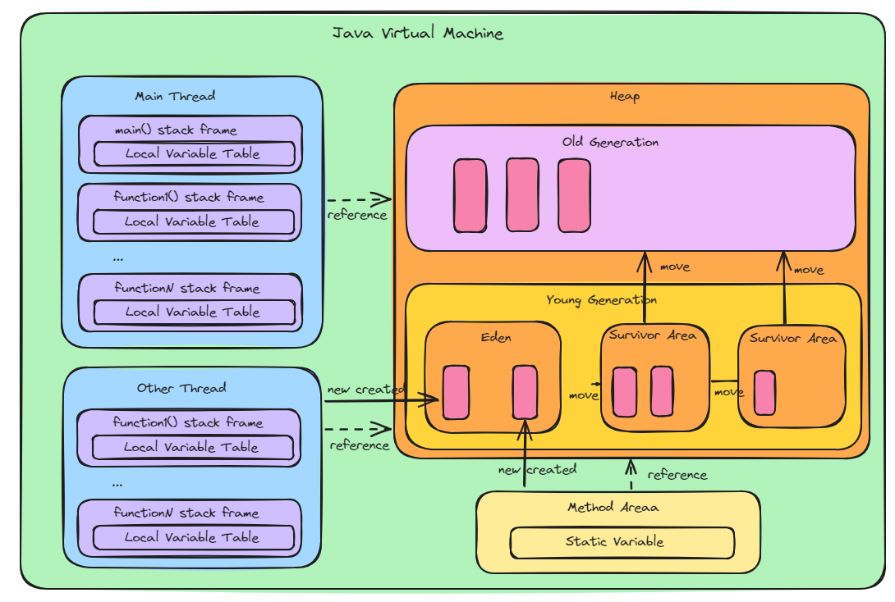
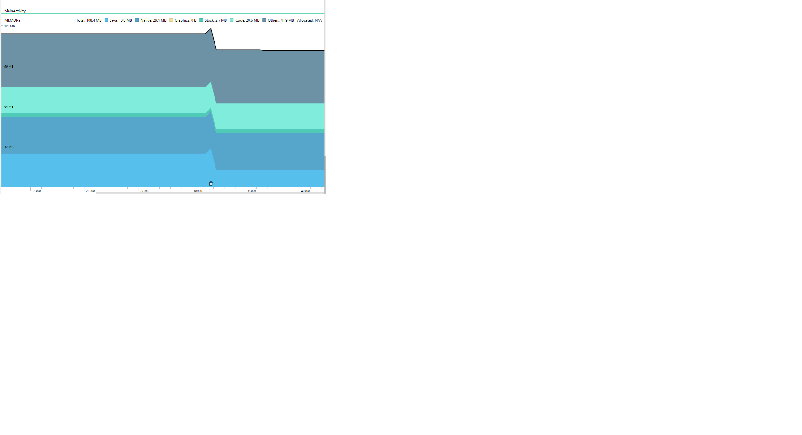
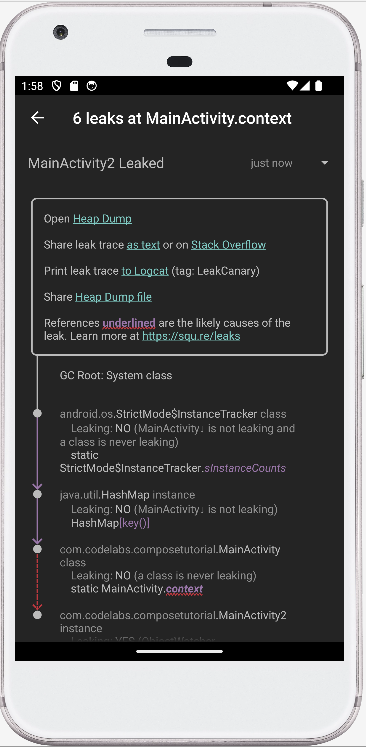

#  A Comprehensive Dive into Android Technical Quality Excellence
This document serves as an exhaustive guide for achieving technical quality excellence in Android development. It covers critical aspects, including stability, performance, app size, and release quality, aiming to equip developers with practical knowledge to guarantee excellent outcomes. Introducing fundamental principles related to quality issues, the guide offers insights into issue identification, monitoring strategies, and problem resolution. With a focus on improving the overall development process, this resource is valuable for ensuring high-quality results in both Android applications and the Android platform. The key features we are going to introduce include:

[- Stability:](#a)

  - [Memory Challenges](#a1)
  
  - [Crash](#a2)

  - [Application not Response (ANR)](#a3)

      
[- Performance:](#b)

  - [Rendering](#b1)
    
  - [Start and loading time ](#b2)

[- Battery and network usage: ](#c) 

[- App Size Optimization:](#d)

[- Security Optimization:](#e)

 <a name="a"></a>
 
## 1 Stability
As a key element of technical quality excellence, stability is fundamental to the overall functionality and success of Android development. Stable products play a critical role in preventing disruptions such as crashes, ANR, and memory challenges, contributing to customer satisfaction. This section will explore the principles of issue identification, effective monitoring strategies, and problem resolution, empowering readers to enhance the robustness of their Android projects.
 <a name="a1"></a>
### 1.1 Memory Challenges
Effective memory management is crucial for achieving optimal performance, preventing crashes, and delivering a seamless user experience in Android products. This section delves into memory management principles in both Java and C/C++, and introduces essential memory monitoring tools along with effective resolution approaches.

#### 1.1.1 Memory Management Principles
##### Java Memory Management Principles
In the Java environment, memory management relies on a garbage collector. It is crucial for developers to understand object lifecycle management and avoid unnecessary object retention. By allowing the garbage collector to reclaim memory efficiently, developers can prevent memory leaks and maintain optimal application performance.
Android employs a memory management strategy leveraging Young Generation garbage collection. In its runtime environments, both the predecessor Dalvik Virtual Machine and the current Android Runtime (ART) adopt principles aligned with Young Generation garbage collection to enhance memory efficiency. Here's a high-level overview of the Young Generation garbage collection process:

- Young Generation Space:
  The Young Generation Space is divided into three spaces: Eden space and two survivor spaces (S0 and S1). Eden is where new objects are initially allocated and referenced by local variables in the stack or static variables in the method area. After each garbage collection cycle, surviving objects are moved to one of the survivor spaces.
- Minor Garbage Collection:
  When Eden space becomes full, a minor garbage collection is triggered. The garbage collector identifies and collects unreferenced or short-lived objects in the Young Generation Space. The surviving objects are moved to one of the survivor spaces. Objects that survive several garbage collection cycles are eventually promoted to the Old Generation.
- Old Generation:
  The Old Generation is a memory space intended for longer-lived objects.
- Major Garbage Collection:
  Major garbage collection involves cleaning up the entire heap. Major GC is triggered when the Old Generation is close to full capacity or when explicit calls are made.

The following diagram shows the main work flow for Android  Jave garbage collection:



We can use VisualVM tool to monitoe above work flow, please see the daigram below:


In Minor/Major Garbage Collection, strong references and weak references play the role below in GC process.

Strong References: Objects referenced by strong references are considered reachable and are not eligible for garbage collection. As long as there is at least one strong reference pointing to an object, it will persist in memory.

Weak References: Objects referenced by weak references are considered weakly reachable. This means that they are eligible for garbage collection even if weak references point to them. When the GC runs, it will collect objects that only have weak references, freeing up memory.

The purpose of weak references is often to avoid memory leaks. For example, in scenarios where an object is only needed as long as there are strong references to it, using weak references allows the object to be collected when no strong references exist, preventing unnecessary memory consumption. The principal has been used by LeakCanary for detecting memory leak.

Based on our analysis, common memory issues in Java include:
- Insufficient Stack or Heap Space:
  This can occur when there is insufficient space or a lack of continuous space in the stack or heap to allocate a Java object. Examples include a stack overflow due to excessive function calls and heap space limitations leading to failed object allocation.
- Memory Leaks:
  A long-lived object referencing a short-lived object can cause memory leaks, because the short-lived object can not appropriately released.
- Excessive Memory Allocation:
  Allocating too much memory in the stack or heap, can strain system resources and result in performance degradation.
- Performance Impact:
  Frequent GC cycles due to an abundance of memory allocation can impact performance negatively.

In conclusion, a comprehensive grasp of these memory management principles empowers developers to create Java applications that not only prevent memory-related pitfalls but also maintain optimal performance. By following best practices and utilizing modern tools, developers can effectively address memory management challenges and deliver top-quality software. We will focus on these topics in later sections.

 <a name="a112"></a>

##### C/C++ Memory Management Principles

In C/C++, memory management relies on manual allocation and deallocation. Developers must explicitly allocate and free memory to prevent memory leaks and maintain optimal performance. Alternatively, smart pointers, such as `std::unique_ptr` and `std::shared_ptr`, can automate memory management and enhance code safety.

**Stack and Heap:**
The stack is used for local variables and function call management. In contrast, the heap is a dynamic memory region where developers manually allocate and free memory.

**Common Memory Issues:**
- *Insufficient Stack or Heap Space:* Insufficient stack space can lead to a stack overflow, often caused by excessive function calls or large local variables. Insufficient heap space can occur when there's not enough continuous memory for dynamic allocation.
  
- *Excessive Memory Allocation:* Allocating too much memory in the stack or heap can strain system resources, leading to performance degradation or memory fragmentation.
  
- *Performance Impact:* Frequent manual memory allocation and deallocation, especially if done inefficiently, can negatively impact performance.

**Specific Memory Issues with Examples:**
- Memory Leaks:
  
  Cause gradually increase in memory usage.
```c
int main() {
    int* dynamicMemory = new int;
    // Missing 'delete' or 'free' statement, leading to a memory leak
    return 0;
}
```

- Buffer Overflow:
  
  Potentially overwriting adjacent memory and causing undefined behavior.
```c
int main() {
    char buffer[5];
    strcpy(buffer, "Overflowing the buffer");
    return 0;
}
```

- Use-After-Free:
  
  Results in undefined behavior, potentially a crash.
```c
int main() {
    int* dynamicMemory = new int;
    delete dynamicMemory;
    *dynamicMemory = 88; // Accessing memory after it has been freed
    return 0;
}
```

- Double Free:
  
  Results in undefined behavior, potentially a crash
```c
int main() {
    int* dynamicMemory = new int;
    delete dynamicMemory;
    delete dynamicMemory; 
    return 0;
}
```


- Out-of-Bounds Array Access:
  
  Results in undefined behavior, potentially a cras
```c
int main() {
    int array[3] = {1, 2, 3};
    int value = array[4]; // Accessing an element beyond the array bounds
    return 0;
}
```

 - Null Pointer Dereference
   
   Causes a segmentation fault as dereferencing a null pointer is an illega
    ```c
    char* ptr = nullptr;
    int value = *ptr; // This line will crash and result in a segmentation fault
    ```

  - Out-of-Bounds Memory Access

    Results in undefined behavior, potentially a crash
    ```c
    int arr[5];
    int value = arr[10]; // This line goes out of bounds and may cause a crash
    ```

  - Dangling Pointer Access
    
    Results in undefined behavior, potentially a crash. 
    ```c
    int* dynamicInt = new int(88);
  
    // Assign the pointer to another variable
    int* anotherPointer = dynamicInt;
    delete dynamicInt;
  
    // Access the memory through the other pointer (dangling pointer),This may cause a crash or undefined behavior
    std::cout << *anotherPointer << std::endl;
  
    // Free the memory again (double deletion),This may cause a crash or undefined behavior
    delete anotherPointer;
    return 0;
    ```
In conclusion, a solid understanding of memory management principles in C++ is essential for developers dedicated to building robust and high-performance software. By following best practices and utilizing modern tools, developers can effectively address memory management challenges and deliver top-quality software. We will focus on these topics in later sections.
  
 <a name="a2"></a>

 #### 1.1.2 Unlocking Memory Optimization

 This section introduces widely used tools to help readers optimize memory in Java and C/C++.

#### 1.1.2.1 Mastering Java Memory Optimization

##### Android Memory Profiler

Android Memory Profiler is an essential tool for Android developers. It helps them ensure optimal memory management, overcome performance challenges, and deliver a seamless user experience on the Android platform. Here is Key Highlights below:

- Memory Profiling: 

   track memory usage, heap dumps,  memory events and  native code allocations and deallocations

- Interface Overview:
  
  Provides a comprehensive timeline, controls for garbage collection and heap dump capture, and memory usage information.

- Memory Counts:

  provide memory counts of  Java, Native, Graphics, Stack, Code, and more. Distinguishes between allocated and deallocated objects.

- Visualizing Allocations:

  Presents a visual representation of memory allocations, includes object types, sizes, and allocation stack traces.

- Memory Leak Detection:
  
  Includes a feature for filtering data indicating potential memory leaks in Activity and Fragment instances.

For example, you can use the picture below to know:
- Java: Memory from objects allocated from Java or Kotlin code.
- Native: Memory from objects allocated from C or C++ code.
- Graphics: Memory used for graphics buffer queues 
- Stack: Memory used by both native and Java stacks in your app.
- Code: Memory that your app uses for code and resources, such as dex bytecode, optimized or compiled dex code, .so libraries, and fonts.
- Others: Memory used by your app that the system isn't sure how to categorize.
- Allocated: The number of Java/Kotlin objects allocated by your app.

  

Please see [the link](https://developer.android.google.cn/studio/profile/memory-profiler) for more information about Android Memory Profiler.

##### LeakCanary

LeakCanary is a powerful memory leak detection library for Android, offering two main features:
- API Check: Developers can manually check any objects that are no longer needed using the provided API. The AppWatcher.objectwatch.watch() function creates a weak reference for the specified object. If this weak reference isn't cleared after a 5-second wait and garbage collection, the watched object is considered potentially leaking, and LeakCanary logs this information.

- Automatic Check: LeakCanary goes beyond manual checks by automatically detecting memory leaks in specific scenarios without requiring additional code. It achieves this by leveraging Android's lifecycle hooks. The library injects calls AppWatcher.objectwatch.watch() automatically into Activity#onDestroy(), Fragment#onDestroy(), Fragment#onDestroyView(), and ViewModel#onCleared(). This automation is based on the understanding that the referenced objects are no longer needed after these lifecycle events, simplifying the process of identifying memory leaks during the development and debugging phases.

Here is the princiapl of LeakCanary:

- ObjectWatcher and Weak References:
  
When an attachedObject is watched using  AppWatcher.objectwatch.watch(attachedObject, description), LeakCanary creates a weak reference to that attachedObject.
- Garbage Collection and Weak References:

After a waiting period of 5 seconds, LeakCanary triggers garbage collection. Weak references allow the associated objects to be collected during garbage collection if there are no strong references pointing to them.

- Detection of Retained Objects:

If the weak reference held by the ObjectWatcher isn't cleared after garbage collection, it implies that the watched object has not been properly released from memory. This situation indicates a potential memory leak, as the object should have been collected if it was no longer needed.

- Logging and Identification:

LeakCanary logs information about the retained object, including its type and any provided description. Developers can inspect these logs to identify and address the source of the memory leak.

In summary, LeakCanary uses weak references and a systematic process of garbage collection and observation to identify objects that should have been released but are still being retained in memory, signaling a potential memory leak. This automated detection simplifies the debugging process for developers.

We take the following code as an example to locate memory leak using LeakCanary.

```c
// Add below in gradle file
debugImplementation ("com.squareup.leakcanary:leakcanary-android:3.0-alpha-1")


class MainActivity : ComponentActivity() {

    companion object {
        lateinit var context : Context
    }
    override fun onCreate(savedInstanceState: Bundle?) {
        super.onCreate(savedInstanceState){
	...
   }
}

// in MainActivity, we have a botton defined as below:

 Button({
        val intent = Intent(context, MainActivity2::class.java)
        context.startActivity(intent)
}) {
        ...
}

class MainActivity2 : AppCompatActivity() {
    ...
    override fun onCreate(savedInstanceState: Bundle?) {
        MainActivity.context = this
    ...
```
From the code, it's evident that a long-lived companion object context has a short-lived object MainActivity2. When we click the back button to finish MainActivity2, it causes a memory leak. The memory leak information obtained from the test phone is shown below:



We can easily identify the cause of the memory leak from the UI on the device.

#### 1.1.2.2 Mastering C/C++ Memory Optimization

In this section, we are going to focus on AddressSanitizer (ASan)/ HWAddressSanitizer (HWASan) tools. Google has intergated ASan into Android system and suggests 'Whenever possible, prefer HWASan.' However, for simplicity in this document, we will use ASan. ASan is a memory error detection tool that helps identify memory-related issues such as buffer overflows, use-after-free, and other memory corruptions at runtime, providing enhanced runtime debugging capabilities. When properly set up in the [building system](https://developer.android.com/ndk/guides/asan), the app can be run without the need to make any code changes
We take the following code as an example to locate memory leak using ASan:
    ```c
jstring native_get_string(JNIEnv* env) {
   std::string s = "Hellooooooooooooooo ";
   std::string_view sv = s + "World\n";
   // BUG:   the expression s + "World\n" creates a temporary string that has a limited lifetime.
   //  `sv` holds reference to the temporary string. After returm, `sv` holds a dangling reference to 
   // the string . Accessing the data here is a  use-after-free.
   return env->NewStringUTF(sv.data());
}

extern "C" JNIEXPORT jstring JNICALL
Java_android11_test_gwpasan_MainActivity_nativeGetString(
    JNIEnv* env, jobject /* this */) {
  jstring return_string;
  for (unsigned i = 0; i < 0x10000; ++i) {
    return_string = native_get_string(env);   // will have memory leak.
  }
  return reinterpret_cast<jstring>(env->NewGlobalRef(return_string));
}
 ```

This example native code has a heap use-after-free bug. It will cause the follwong log from logcate or /data/tombstone:
```c
*** *** *** *** *** *** *** *** *** *** *** *** *** *** *** ***
Build fingerprint: 'google/sargo/sargo:10/RPP3.200320.009/6360804:userdebug/dev-keys'
Revision: 'PVT1.0'
ABI: 'arm64'
Timestamp: 2020-04-06 18:27:08-0700
pid: 16227, tid: 16227, name: 11.test.gwpasan  >>> android11.test.gwpasan <<<
uid: 10238
signal 11 (SIGSEGV), code 2 (SEGV_ACCERR), fault addr 0x736ad4afe0
Cause: [GWP-ASan]: Use After Free on a 32-byte allocation at 0x736ad4afe0

backtrace:
      #00 pc 000000000037a090  /apex/com.android.art/lib64/libart.so (art::(anonymous namespace)::ScopedCheck::CheckNonHeapValue(char, art::(anonymous namespace)::JniValueType)+448)
      #01 pc 0000000000378440  /apex/com.android.art/lib64/libart.so (art::(anonymous namespace)::ScopedCheck::CheckPossibleHeapValue(art::ScopedObjectAccess&, char, art::(anonymous namespace)::JniValueType)+204)
      #02 pc 0000000000377bec  /apex/com.android.art/lib64/libart.so (art::(anonymous namespace)::ScopedCheck::Check(art::ScopedObjectAccess&, bool, char const*, art::(anonymous namespace)::JniValueType*)+612)
      #03 pc 000000000036dcf4  /apex/com.android.art/lib64/libart.so (art::(anonymous namespace)::CheckJNI::NewStringUTF(_JNIEnv*, char const*)+708)
      #04 pc 000000000000eda4  /data/app/android11.test.gwpasan/lib/arm64/libmy-test.so (_JNIEnv::NewStringUTF(char const*)+40)
      #05 pc 000000000000eab8  /data/app/android11.test.gwpasan/lib/arm64/libmy-test.so (native_get_string(_JNIEnv*)+144)
      #06 pc 000000000000edf8  /data/app/android11.test.gwpasan/lib/arm64/libmy-test.so (Java_android11_test_gwpasan_MainActivity_nativeGetString+44)
      ...

deallocated by thread 16227:
      #00 pc 0000000000048970  /apex/com.android.runtime/lib64/bionic/libc.so (gwp_asan::AllocationMetadata::CallSiteInfo::RecordBacktrace(unsigned long (*)(unsigned long*, unsigned long))+80)
      #01 pc 0000000000048f30  /apex/com.android.runtime/lib64/bionic/libc.so (gwp_asan::GuardedPoolAllocator::deallocate(void*)+184)
      #02 pc 000000000000f130  /data/app/android11.test.gwpasan/lib/arm64/libmy-test.so (std::__ndk1::_DeallocateCaller::__do_call(void*)+20)
      ...
      #08 pc 000000000000ed6c  /data/app/android11.test.gwpasan/lib/arm64/libmy-test.so (std::__ndk1::basic_string<char, std::__ndk1::char_traits<char>, std::__ndk1::allocator<char> >::~basic_string()+100)
      #09 pc 000000000000ea90  /data/app/android11.test.gwpasan/lib/arm64/libmy-test.so (native_get_string(_JNIEnv*)+104)
      #10 pc 000000000000edf8  /data/app/android11.test.gwpasan/lib/arm64/libmy-test.so (Java_android11_test_gwpasan_MainActivity_nativeGetString+44)
      ...
```

For more detailed information about analyzing the log files generated by Asan, you can refer to the [link] (https://developer.android.com/ndk/guides/gwp-asan) . We will introduce how the log file is captured in the Crash Challenges section.

### 1.2 Crash Challenges
Handling and resolving crashes are essential in software development and for maintaining system reliability. When Android products encounter crashes, they disrupt user experiences and pose a risk to data integrity and system stability. Effectively addressing crashes involves navigating through various stages, including unraveling crashes, crashes analysis,  crashes monitoring, and approaches to preventing crashes. This section focuses on these aspects to provide readers with valuable insights into managing crashes, ensuring a seamless user experience, and enhancing overall system stability.

#### 1.2.1  Decoding the Anatomy of Crashes

Understanding the details of crash events is crucial for developers to effectively address and prevent them. See below sample code snippets in Kotlin, and C/C++ for common scenarios where crashes occur:
- Kotlin:
  - FileNotFoundException: 
    ```c
    val file = File(Environment.getExternalStorageDirectory(), "example.txt")
    val inputStream = FileInputStream(file)  // FileNotFoundException
    ```

  - SecurityException: 
    ```c
    val uri = Uri.parse("content://com.android.contacts/data/1")
    val inputStream = contentResolver.openInputStream(uri) 
    ```

  - ArrayIndexOutOfBoundsException:
    ```c
    val androidVersions = arrayOf("Jelly Bean", "KitKat", "Lollipop", "Marshmallow")
    val version = androidVersions[10] 
    ```

- C/C++
  See Null Pointer Dereference, Out-of-Bounds Memory Access, Dangling Pointer Access listed in [section 1.1.2 Memory Management Principles in C++](#a112)

  - Division by Zero
    ```c
    int numerator = 88;
    int denominator = 0;
    int result = numerator / denominator; // This line will crash and result in a segmentation fault
    ```

As we can see, a common scenario for Java/Kotlin app crashes is caused by an uncaught throwable/exception and most crashes on the native side (C/C++) are related to improper memory handling. Therefore, to aid in identifying, locating, monitoring, and solving Java crash issues, it is crucial to understand how the Android system handles crashes in Java environments. The following diagram shows the main work flow related to this topic:


Let's explain the daigram:
- Java/Kotlin based Components (App and System Server) Crash Handling:
  - App sets default uncaught exception handle:
    
     When an app is forked, it calls Thread.setDefaultUncaughtExceptionHandler(new KillApplicationHandler()) to set the default uncaught exception handler for all throwable or exceptions in the process using an instance of KillApplicationHandler. Now, when an uncaught exception occurs in any thread within the process, KillApplicationHandler.uncaughtException() will be called to handle that exception.
  - App sets default uncaught exception handle:
    
    uncaughtException() calls the ActivityManager method handleApplicationCrash() when a throwable is not caught in the current app to request ActivityManagerService(AMS) for crash handling.
  - AMS Crash Handling:
    
    AMS collects all crash information needs through handleApplicationCrashInner() and sends it to DropManagerService by calling the method DropManager#addData().
  - DropManagerService creates crash log information:
    
    DropManagerService receives the crash information from AMS and store crash information log file into /data/system/drop folder.
  - App Self-Termination Handling:
    
    the App takes appropriate actions to terminate itself.

- Native components (JNI and Daemon) Memory Issue and Crash Handling:

  Any native component crash will cause the kernel to issue a signal from the list below in Android:
  - SIGABRT (Abort)
  - SIGBUS (Bus Error)
  - SIGFPE (Floating Point Exception)
  - SIGILL (Illegal Instruction)
  - SIGSEGV (Segmentation Fault)
  - SIGSTKFLT (Stack Fault)
    
  To support users in analyzing crashes and memory issues, Android loads liblinker, debugged library, and [libAsan] (https://developer.android.com/ndk/guides/gwp-asan) when the app is started. This loading occurs as part of the Android runtime environment and aims to enhance debugging and analysis capabilities during runtime.
   - liblinker: A part of the Android runtime environment responsible for dynamic linking, loading, and unloading of shared libraries.
   - Debugged Library: When loaded, it provides additional debugging information, aiding developers in identifying and resolving issues during runtime.
   - libAsan (Android 8.1+): libAsan (AddressSanitizer) is a memory error detector tool that helps identify memory-related issues such as buffer overflows, use-after-free, and other memory corruptions at runtime, providing enhanced runtime debugging capabilities.

  When an ASan issue or crash occurs, the kernel and ASan tool provides detailed information about the problem, including the location in the code where the issue happened, the type of issue (e.g., buffer overflow), and other relevant details. This information is valuable for developers to identify and fix bugs that could lead to crashes or other unexpected behavior. We will discuss this information in the next section. This section focuses on how the information of ASan issues or crashes is collected (To simplify, we call it a crash issue here). Here is the main workflow related to this topic:
  - Triggle crash issue handling:
    
    The kernel triggers a crash signal or ASan triggers a memory issue. It causes the current app to use the debuggerd_signal_handler() method in the debugged library to handle crash issue information.
  - Create debuggerd dispatch pseudo thread to transfer crash issue information to the crashdump process:
    
    The debuggerd_signal_handler() method creates the debuggerd_dispatch_pseudo_thread. The debuggerd_dispatch_pseudo_thread creates the crashdump process and passes crash issue information to crashdump using a Pipe.
  - Log handling:
    
    The crashdump uses UDS to send crash issue information to tombstoned daemon for logging and store the informatuin at /data/tombstone.  The crashdump also uses UDS to send crash issue information to AMS for logging.
  - AMS Crash Handling:
    
    AMS has a NativeCrashListener thread started at the System Server launch stage. It creates a UDS socket to observe the crash from the crashdump process. If it receives crash issue information from the crashdump process, it creates a NativeCrashReport thread and calls handleApplicationCrashInner() for further handling.
  - DropManagerService creates crash log information.
    
    Similar to the handling in Java code, the crash log is put into the /data/drop folder.

Please note that the above workflow is available only for Android apps. However, we can also utilize Debugged and libAsan for our native Daemon development if necessary.

#### 1.2.2  Crash Analysis
Crash log files play a crucial role in identifying and resolving issues in Android development. Analyzing these logs provides valuable information about the root cause of crashes, contributing to enhancements in stability and user experience. Let's proceed to analyze several crash log files using both example code and log files.
##### 1.2.2.1  Java crash logfile analysis 

  We provide the following source code in MainActivity:
  ```c
        52  val contentResolver = contentResolver
        53  val uri = Uri.parse("content://com.android.contacts/data/1")
        54  val inputStream = contentResolver.openInputStream(uri) // SecurityException
 ```

  Run the application, we obtain the followng [log infromation](data_app_crash@1704743557731.txt) in /data/system/dropbox or logcat:

```c
java.lang.RuntimeException: Unable to start activity ComponentInfo{com.codelabs.composetutorial/com.codelabs.composetutorial.MainActivity}: java.lang.SecurityException: Permission Denial: ... 
	at android.app.ActivityThread.performLaunchActivity(ActivityThread.java:3782)
	at android.app.ActivityThread.handleLaunchActivity(ActivityThread.java:3922)...
	at com.android.internal.os.ZygoteInit.main(ZygoteInit.java:971)
Caused by: java.lang.SecurityException: Permission Denial: opening provider ...
	at android.os.Parcel.createExceptionOrNull(Parcel.java:3057)
	at android.os.Parcel.createException(Parcel.java:3041)...
	at android.content.ContentResolver.openInputStream(ContentResolver.java:1528)
	at com.codelabs.composetutorial.MainActivity.onCreate(MainActivity.kt:54)...
Caused by: android.os.RemoteException: Remote stack trace:
	at com.android.server.am.ContentProviderHelper.checkAssociationAndPermissionLocked(ContentProviderHelper.java:691)
	at com.android.server.am.ContentProviderHelper.getContentProviderImpl(ContentProviderHelper.java:287)
	at com.android.server.am.ContentProviderHelper.getContentProvider(ContentProviderHelper.java:144)
	at com.android.server.am.ActivityManagerService.getContentProvider(ActivityManagerService.java:6697)
	at android.app.IActivityManager$Stub.onTransact(IActivityManager.java:2761)
 ```
As seen, one crash causes 3 exceptions, making it challenging for the reader to understand. Let's provide further clarification:

- Binder IPC Failure - RemoteException
  - Description: The initial failure occurs in Binder Inter-Process Communication (IPC).
  - Cause: The IPC failure is a result of a permission issue, leading to a SecurityException.
  - Details: The RemoteException is thrown, indicating a problem in the communication channel.

- Propagation to SecurityException - Binder Proxy
  - Description: The SecurityException is detected and re-thrown in the Binder Proxy layer.
  - Cause: The SecurityException is the underlying issue in the IPC failure.
  - Details: The Binder Proxy, upon handling the RemoteException, identifies the embedded SecurityException and re-throws it.
    
- Exception Propagation to RuntimeException - ActivityThread
  - Description: The SecurityException further propagates up the stack, resulting in a java.lang.RuntimeException.
  - Cause: The root cause of the RuntimeException is the original SecurityException from the IPC failure.
  - Details: ActivityThread, during the launch of the activity, re-throws the received RuntimeException.

In a stack trace, the order of exceptions is typically determined by the order in which they were thrown. The most recently thrown exception (RuntimeException) appears at the top of the log without having a "Caused by:" prefix. The last caught exception (RemoteException) is at the bottom of the log. In this example, the root cause can be easily identified in line 54 based on the information:
  at com.codelabs.composetutorial.MainActivity.onCreate(MainActivity.kt:54)
Normally, the presence of the current app package name (e.g., com.codelabs.composetutorial) may indicate the specific location in our code where the issue or crash occurred. Analyzing this part of the code may help identify the root cause of the problem.

##### 1.2.2.2  Native Crash Log file Analysis 
 We provide the following source code:
```c
void com::example::Crasher::crash() {
    int* nullPointer = nullptr;
    *nullPointer = 88; // Attempting to dereference a null pointer
}

extern "C" {
    JNIEXPORT void JNICALL
    Java_com_example_testapp_MainActivity_runCrashThread(JNIEnv *env, jobject instance) {
        com::example::Crasher::crash();
    }
}
```

Run the application including above code, we obtain the followng log infromation in /data/tombstone or logcat:

```c
*** *** *** *** *** *** *** *** *** *** *** *** *** *** *** ***
Build fingerprint: 'google/foo/bar:10/123.456/78910:user/release-keys'
ABI: 'arm64'
Timestamp: 2020-02-16 11:16:31+0100
pid: 8288, tid: 8288, name: com.example.testapp  >>> com.example.testapp <<<
uid: 1010332
signal 11 (SIGSEGV), code 1 (SEGV_MAPERR), fault addr 0x0
Cause: null pointer dereference
    x0  0000007da81396c0  x1  0000007fc91522d4  x2  0000000000000001  x3  000000000000206e
    x4  0000007da8087000  x5  0000007fc9152310  x6  0000007d209c6c68  x7  0000007da8087000
    x8  0000000000000000  x9  0000007cba01b660  x10 0000000000430000  x11 0000007d80000000
    x12 0000000000000060  x13 0000000023fafc10  x14 0000000000000006  x15 ffffffffffffffff
    x16 0000007cba01b618  x17 0000007da44c88c0  x18 0000007da943c000  x19 0000007da8087000
    x20 0000000000000000  x21 0000007da8087000  x22 0000007fc9152540  x23 0000007d17982d6b
    x24 0000000000000004  x25 0000007da823c020  x26 0000007da80870b0  x27 0000000000000001
    x28 0000007fc91522d0  x29 0000007fc91522a0
    sp  0000007fc9152290  lr  0000007d22d4e354  pc  0000007cba01b640

backtrace:
  #00  pc 0000000000042f89  /data/app/com.example.testapp/lib/arm64/libexample.so (com::example::Crasher::crash() const)
  #01  pc 0000000000000640  /data/app/com.example.testapp/lib/arm64/libexample.so (com::example::runCrashThread())
  #02  pc 0000000000065a3b  /system/lib/libc.so (__pthread_start(void*))
  #03  pc 000000000001e4fd  /system/lib/libc.so (__start_thread)
```
We can get a lot of information such as pid, uid, app package name, crash signal , carsh coause , register information and  backtrace for us to locate crash issue.

#### 1.2.3  Crash Monitoring

Android Vitals and Firebase Crashlytics are two distinct services offered by Google that exclusively manage issues arising from Java code. They both provide a comprehensive set of crash data and analytics to help developers diagnose and understand issues within their Android applications. For example, metrics related to the crash include:

- the number of affected users, the frequency of occurrences, and any other relevant statistical data.
- The version of the application in which the crash occurred.
- A detailed stack trace highlighting the sequence of method calls and the location where the crash occurred.
- Details about the device on which the crash occurred, such as the device model, manufacturer, and operating system version.

By analyzing the information provided in the services, developers can prioritize and address the most critical issues impacting their application's stability.
Application developers can also develop their own custom crash monitoring system. Here is the code to collect the java crash information in application:

```c
class MyApplication : Application(), Thread.UncaughtExceptionHandler {
    private var systemUncaughtExceptionHandler: Thread.UncaughtExceptionHandler? = null
    override fun onCreate() {
        super.onCreate()
        systemUncaughtExceptionHandler = Thread.getDefaultUncaughtExceptionHandler()
        Thread.setDefaultUncaughtExceptionHandler(this)
        // Additional initialization code if needed
    }
    override fun uncaughtException(thread: Thread, ex: Throwable) {
        // Save the crash details to a file, database, or send it to a server
        saveCrashDetailsToFile(ex)
        val background = mainLooper.thread != thread
        if (systemUncaughtExceptionHandler != null) {
            val handler = Handler(mainLooper)
            handler.post {
                // If the user hasn't handled it, let the system default exception handler handle it
                systemUncaughtExceptionHandler?.uncaughtException(thread, ex)
            }
        }
    }
}
```
For native crash information, developers can employ the signal approach by registering signal handlers for specific signals like SIGABRT, SIGBUS, SIGFPE, SIGILL, SIGSEGV, SIGSTKFLT, SIGSYS, and SIGTRAP. When a crash occurs, the associated signal handler function is invoked, enabling developers to capture essential crash details. This method offers a granular level of control over crash reporting, allowing customization of reporting mechanisms based on the requirements. By leveraging signal handlers, developers can inject their crash reporting logic, whether it involves logging, saving crash details to a file, or transmitting information to a monitoring service. This approach is valuable for addressing native crashes and adapting crash reporting to suit specific development needs.

#### 1.2.4  Strategies to Prevent Crashes

In this section, we'll explore strategies to prevent crashes in Android apps and focus on coding best practices and workaround solutions to enhance stability. Solving crashes is very challenging; therefore, we recommend the following coding best practices.
- Input Validation: Ensure thorough validation of user inputs to prevent unexpected data from causing issues.
- Null Checks:Perform explicit null checks, especially before accessing object references.
- Memory Management: Efficiently manage object creation and destruction, and consider using tools like the Android Profiler to identify memory leaks.
- Thread Safety: Implement thread safety measures, especially when dealing with shared resources. Use synchronization or concurrency mechanisms to prevent race conditions and crashes due to improper threading.
- Handle Configuration Changes: Account for configuration changes (e.g., screen rotations) by properly handling the lifecycle events.
- Use Libraries Carefully: When integrating third-party libraries, ensure they are well-maintained, up-to-date, and compatible with your app's requirements.
- Testing and QA: Conduct thorough testing, including unit tests, integration tests, and real-device testing.
- Crash Reporting: Integrate a crash reporting tool like Firebase Crashlytics or other similar services. 
- Regular Updates: Keep your app and its dependencies up-to-date. 
- Error Handling: Provide meaningful error messages to users, log errors for developers, and gracefully handle unexpected scenarios to prevent crashes.
- Static Code Analysis Tool Scaning:  the tool is essential for identifying potential issues, vulnerabilities, and maintaining code quality in software development. 
- Thorough Code Review: Conduct regular code reviews to catch potential issues early.
- Input Validation: Ensure thorough validation of user inputs to prevent unexpected data and potential crashes.
- Proactive Logging: Implement comprehensive logging to record relevant information, aiding in identifying and resolving issues before they lead to crashes.
- Asynchronous Operations: Handle asynchronous operations carefully, considering callback execution on the main thread and preventing ANR (Application Not Responding) errors.
- Resource Management: Manage resources efficiently, releasing unused resources promptly to prevent memory leaks and ensure optimal app performance.
- Permission Checks: Verify and request permissions appropriately to avoid security-related crashes.
- Network Connectivity: Safeguard against network-related crashes by checking for network availability before initiating network operations.

Effective memory management is crucial for achieving optimal performance, preventing crashes, and delivering a seamless user experience in Android products. This section delves into memory management principles in both Java and C/C++, and introduces essential memory monitoring tools along with effective resolution approaches.
