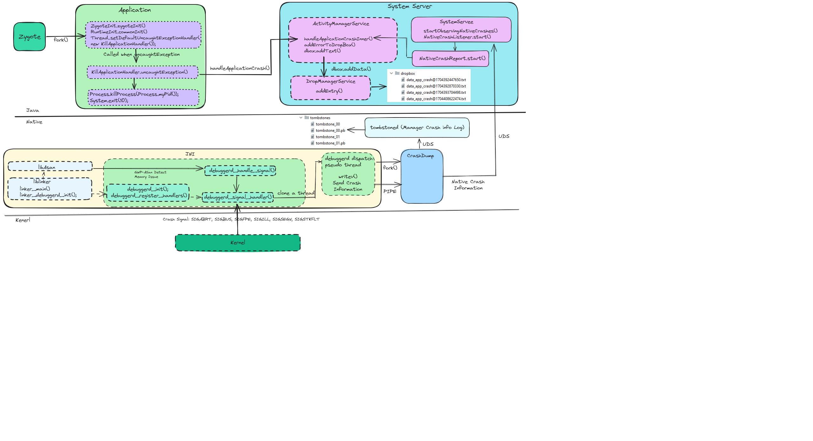

#  A Comprehensive Dive into Android Technical Quality Excellence
This document serves as an exhaustive guide for achieving technical quality excellence in Android development. It covers critical aspects, including stability, performance, app size, and release quality, aiming to equip developers with practical knowledge to guarantee excellent outcomes. Introducing fundamental principles related to quality issues, the guide offers insights into issue identification, monitoring strategies, and problem resolution. With a focus on improving the overall development process, this resource is valuable for ensuring high-quality results in both Android applications and the Android platform. The key features we are going to introduce include:

[- Stability:](#a)

  - [Crash](#a1)

  - [Application not Response (ANR)](#a2)

  - [Memory Challenges](#a3)
      
[- Performance:](#b)

  - [Start and loading time ](#b1)

  - [Rendering](#b2)

[- Battery and network usage: ](#c) 
[- App Size Optimation:](#d)
[- Security Optimation:](#e)

 <a name="a"></a>
 
## 1 Stability
As a key element of technical quality excellence, stability is fundamental to the overall functionality and success of Android development. Stable products play a critical role in preventing disruptions such as crashes, ANR, and memory challenges, contributing to customer satisfaction. This section will explore the principles of issue identification, effective monitoring strategies, and problem resolution, empowering readers to enhance the robustness of their Android projects.

### 1.1 Crash
Handling and resolving crashes are essential in software development and for maintaining system reliability. When Android products encounter crashes, they disrupt user experiences and pose a risk to data integrity and system stability. Effectively addressing crashes involves navigating through various stages, including unraveling crashes, in-depth Analysis,  monitoring, and approaches to preventing crashes. This section focuses on these aspects to provide readers with valuable insights into managing crashes, ensuring a seamless user experience, and enhancing overall system stability.

#### 1.1.1  Decoding the Anatomy of Crashes

Understanding the details of crash events is crucial for developers to effectively address and prevent them. See below sample code snippets in Kotlin, and C/C++ for common scenarios where crashes occur:
- Kotlin:
  - FileNotFoundException: 
    ```c
    val file = File(Environment.getExternalStorageDirectory(), "example.txt")
    val inputStream = FileInputStream(file)  // FileNotFoundException
    ```

  - SecurityException: 
    ```c
    val uri = Uri.parse("content://com.android.contacts/data/1")
    val inputStream = contentResolver.openInputStream(uri) 
    ```

  - ArrayIndexOutOfBoundsException:
    ```c
    val androidVersions = arrayOf("Jelly Bean", "KitKat", "Lollipop", "Marshmallow")
    val version = androidVersions[10] 
    ```

- C/C++
  - Null Pointer Dereference
    ```c
    char* ptr = nullptr;
    int value = *ptr; // This line will crash and result in a segmentation fault
    ```

  - Out-of-Bounds Memory Access
    ```c
    int arr[5];
    int value = arr[10]; // This line goes out of bounds and may cause a crash
    ```

  - Division by Zero
    ```c
    int numerator = 88;
    int denominator = 0;
    int result = numerator / denominator; // This line will crash and result in a segmentation fault
    ```

  - Dangling Pointer Access
    ```c
    int* dynamicInt = new int(88);
  
    // Assign the pointer to another variable
    int* anotherPointer = dynamicInt;
    delete dynamicInt;
  
    // Access the memory through the other pointer (dangling pointer),This may cause a crash or undefined behavior
    std::cout << *anotherPointer << std::endl;
  
    // Free the memory again (double deletion),This may cause a crash or undefined behavior
    delete anotherPointer;
    return 0;
    ```

- Java/Kotlin based Components (App and System Server) Crash Handling:
  
  As we can see, a common scenario for Java/Kotlin app crashes is caused by an uncaught Throwable. Therefore, to aid in identifying, locating, monitoring, and solving Java crash issues, it is crucial to understand how the Android system handles crashes in Java environments. Here is the main workflow related to this topic::
  - App sets default uncaught exception handle:
     When an app is forked, it calls Thread.setDefaultUncaughtExceptionHandler(new KillApplicationHandler()) to set the default uncaught exception handler for all throwable or exceptions in the process using an instance of KillApplicationHandler. Now, when an uncaught exception occurs in any thread within the process, KillApplicationHandler.uncaughtException() will be called to handle that exception.
  - App sets default uncaught exception handle:
    uncaughtException() calls the ActivityManager method handleApplicationCrash() when a throwable is not caught in the current app to request ActivityManagerService(AMS) for crash handling.
  - AMS Crash Handling:
    AMS collects all crash information needs through handleApplicationCrashInner() and sends it to DropManagerService by calling the method DropManager#addData().
  - DropManagerService creates crash log information.
    DropManagerService receives the crash information from AMS and store crash information log file into /data/system/drop folder.
  - App Self-Termination Handling:
    the App takes appropriate actions to terminate itself.
See the java side of the following diagram for more detail.



- Native components (JNI and Daemon) Memory Issue and Crash Handling:

  Any native component crash will cause the kernel to issue a signal from the list below in Android:
  - SIGABRT (Abort)
  - SIGBUS (Bus Error)
  - SIGFPE (Floating Point Exception)
  - SIGILL (Illegal Instruction)
  - SIGSEGV (Segmentation Fault)
  - SIGSTKFLT (Stack Fault)
    
  Most crashes on the native side (C/C++) are related to improper memory handling. See some example code provided above. To support users in analyzing crashes and memory issues, Android loads liblinker, debugged library, and libAsan (Android 8.1+) when the app is started. This loading occurs as part of the Android runtime environment and aims to enhance debugging and analysis capabilities during runtime.
   - liblinker: A part of the Android runtime environment responsible for dynamic linking, loading, and unloading of shared libraries.
   - Debugged Library: When loaded, it provides additional debugging information, aiding developers in identifying and resolving issues during runtime.
   - libAsan (Android 8.1+): libAsan (AddressSanitizer) is a memory error detector tool that helps identify memory-related issues such as buffer overflows, use-after-free, and other memory corruptions at runtime, providing enhanced runtime debugging capabilities.

  When an ASan issue or crash occurs, the kernel and ASan tool provides detailed information about the problem, including the location in the code where the issue happened, the type of issue (e.g., buffer overflow), and other relevant details. This information is valuable for developers to identify and fix bugs that could lead to crashes or other unexpected behavior. We will discuss this information in the next section. This section focuses on how the information of ASan issues or crashes is collected (To simplify, we call it a crash issue here). Here is the main workflow related to this topic:
  - Triggle crash issue handling:
    The kernel triggers a crash signal or ASan triggers a memory issue. It causes the current app to use the debuggerd_signal_handler() method in the debugged library to handle crash issue information.
  - Create debuggerd dispatch pseudo thread to transfer crash issue information to the crashdump process:
    The debuggerd_signal_handler() method creates the debuggerd_dispatch_pseudo_thread. The debuggerd_dispatch_pseudo_thread creates the crashdump process and passes crash issue information to crashdump using a Pipe.
  - Log handling:
    The crashdump uses UDS to send crash issue information to tombstoned daemon for logging and store the informatuin at /data/tombstone.  The crashdump also uses UDS to send crash issue information to AMS for logging.
  - AMS Crash Handling:
    AMS has a NativeCrashListener thread started at the System Server launch stage. It creates a UDS socket to observe the crash from the crashdump process. If it receives crash issue information from the crashdump process, it creates a NativeCrashReport thread and calls handleApplicationCrashInner() for further handling.
  - DropManagerService creates crash log information.
    Similar to the handling in Java code, the crash log is put into the /data/drop folder.

See the native side of the above diagram for more detail. Please note that the above workflow is available only for Android apps. However, we can also utilize Debugged and libAsan for our native Daemon development if necessary.


1、如何捕获崩溃（比如c++常见的野指针错误或是内存读写越界，当发生这些情况时程序不是异常退出了吗，我们如何捕获它呢）

2、如何获取堆栈信息（告诉我们崩溃是哪个函数，甚至是第几行发生的，这样我们才可能重现并修改问题）

3、将错误日志上传到指定服务器（这个最好办）

 

#### 1.1.2  Crash Analysis and Monitoring
Crash log files play a crucial role in identifying and resolving issues in Android development. Analyzing these logs provides valuable insights into the root cause of crashes, facilitating improvements in stability and user experience. Following the introduction on reading a crash log file through example code, we will proceed to analyze several crash log files.
- Java crash logfile
  We provide the following source code in MainActivity:
  ```c
        52  val contentResolver = contentResolver
        53  val uri = Uri.parse("content://com.android.contacts/data/1")
        54  val inputStream = contentResolver.openInputStream(uri) // SecurityException
 ```
Run the application, we obtain the followng [log infromation](data_app_crash@1704743557731.txt) in /data/system/dropbox or logcat:
```c
java.lang.RuntimeException: Unable to start activity ComponentInfo{com.codelabs.composetutorial/com.codelabs.composetutorial.MainActivity}: java.lang.SecurityException: Permission Denial: ... 
	at android.app.ActivityThread.performLaunchActivity(ActivityThread.java:3782)
	at android.app.ActivityThread.handleLaunchActivity(ActivityThread.java:3922)
...
	at com.android.internal.os.ZygoteInit.main(ZygoteInit.java:971)
Caused by: java.lang.SecurityException: Permission Denial: opening provider ...
	at android.os.Parcel.createExceptionOrNull(Parcel.java:3057)
	at android.os.Parcel.createException(Parcel.java:3041)
...
	at android.content.ContentResolver.openInputStream(ContentResolver.java:1528)
	at com.codelabs.composetutorial.MainActivity.onCreate(MainActivity.kt:54)
...
Caused by: android.os.RemoteException: Remote stack trace:
	at com.android.server.am.ContentProviderHelper.checkAssociationAndPermissionLocked(ContentProviderHelper.java:691)
	at com.android.server.am.ContentProviderHelper.getContentProviderImpl(ContentProviderHelper.java:287)
	at com.android.server.am.ContentProviderHelper.getContentProvider(ContentProviderHelper.java:144)
	at com.android.server.am.ActivityManagerService.getContentProvider(ActivityManagerService.java:6697)
	at android.app.IActivityManager$Stub.onTransact(IActivityManager.java:2761)
 ```
As seen, one crash causes 3 exceptions, making it challenging for the reader to understand. Let's provide further clarification:

- Binder IPC Failure - RemoteException
  Description: The initial failure occurs in Binder Inter-Process Communication (IPC).
  Cause: The IPC failure is a result of a permission issue, leading to a SecurityException.
  Details: The RemoteException is thrown, indicating a problem in the communication channel.
- Propagation to SecurityException - Binder Proxy
  Description: The SecurityException is detected and re-thrown in the Binder Proxy layer.
  Cause: The SecurityException is the underlying issue in the IPC failure.
  Details: The Binder Proxy, upon handling the RemoteException, identifies the embedded SecurityException and re-throws it.
- Exception Propagation to RuntimeException - ActivityThread
  Description: The SecurityException further propagates up the stack, resulting in a java.lang.RuntimeException.
  Cause: The root cause of the RuntimeException is the original SecurityException from the IPC failure.
  Details: ActivityThread, during the launch of the activity, re-throws the received RuntimeException.

In a stack trace, the order of exceptions is typically determined by the order in which they were thrown. The most recently thrown exception (RuntimeException) appears at the top of the log without having a "Caused by:" prefix. The last caught exception (RemoteException) is at the bottom of the log. In this example, the root cause can be easily identified in line 54 based on the information:
  at com.codelabs.composetutorial.MainActivity.onCreate(MainActivity.kt:54)
Normally, the presence of the current app package name (e.g., com.codelabs.composetutorial) may indicate the specific location in our code where the issue or crash occurred. Analyzing this part of the code may help identify the root cause of the problem.

#### 1.1.3  Strategies to Prevent Crashes
