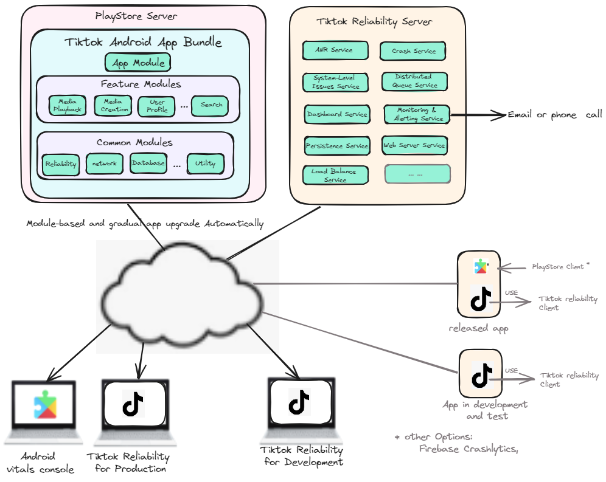

# TikTok Android App Reliability Framework Recommendations
**by [Jinlin Xu]**

# 1 Overview

The primary goal of the reliability framework is to enhance the TikTok Android app's reliability by addressing the following issues:
- General app issues such as crashes, ANRs, performance challenges, memory management issues, and system event-related problems (e.g., network changes, battery events).
- TikTok-specific issues (to be defined) such as time spent and battery usage when a specific button is clicked or a task is performed.
- Ensure the reliability, monitoring, alerting, identification, and location of issues while maintaining the overall quality of the TikTok app throughout its lifecycle, including the stages of development, testing, app publishing, release, and upgrade.

As a result of the framework, it can help us minimize issues during app release and facilitate quick updates through module-based delivery.
The flexibility of this reliability framework allows for potential extension to different operating systems, providing a versatile solution for enhancing app reliability across diverse platforms.

# 2 Requirement Analysis

## 2.1 Functional Requirements

### 2.1.1 Tiktok Reliability Client

- **Identify Issues:**
  - Develop functionality to identify issues within the TikTok app. 
  
- **Issue Collection:**
  - Implement a mechanism to collect issues, including call stack information, from the suite of automated/manual tests in the global QA and development teams.
  
- **Data Transfer:**
  - Enable the transfer of necessary issue information to the Tiktok Reliability Server, with user consent.
  
- **Integration Interface:**
  - Develop an interface for the QA team to seamlessly integrate the Tiktok Reliability Client into their automation test cases.

### 2.1.2 On-Demand Modules

  - Create on-demand modules to allow independent upgrading of specific modules without impacting the entire app.

### 2.1.3 Tiktok Reliability Server

- **Issue Collection:**
  - Develop the capability to collect issues from devices with the TikTok app installed.

- **Reliability Dashboard:**
  - Provide a reliability dashboard for the development/QA team to assess the performance of the TikTok app.

- **Monitoring & Alerting Service:**
  - Implement a monitoring and alerting service for the development/QA team to identify, locate, and resolve issues efficiently.

- **Reliability REST API:**
  - Provide a reliability REST API to enable the development/QA team to incorporate additional features for issue analysis.

## 2.2 Non-Functional Requirements

### 2.2.1 Scalability

- **Issue Collection:**
  - Ensure the system can scale to collect issues from a billion devices.

### 2.2.2 Performance

- **Impact on TikTok App:**
  - Minimize the performance impact on the TikTok app during issue collection. If no issues are detected, ensure zero impact.

### 2.2.3 Security

- **Access Control:**
  - Implement robust access control mechanisms to restrict system usage to authorized personnel only.

# 3 Existing Reliabilty Systems

## 3.1 Android Vitals

Android Vitals is an integral part of the Android operating system, providing essential tools to seamlessly monitor and analyze app performance. Key features include:

- Data Collection Mechanism: Android Vitals components collect vital issue (crashes, ANRs, and other essential data) directly from users' devices, ensuring minimal impact on app runtime.
- Comprehensive Dashboard: The Android Vitals console offers a user-friendly dashboard for developers to assess and enhance the overall app quality and user experience.
- Playstore Reporting Rest API: Developers can leverage the Playstore Reporting Rest API to collect detailed app quality data from Android Vitals.

## 3.2 Firebase Crashlytics

Firebase Crashlytics is a reporting tool simiar as Android Vista. It only focuses on crash issues. Key features include:

- Data Collection Mechanism: Firebase Crashlytics collects crashes issue directly from users' devices, ensuring minimal impact on app runtime.
- Crash Reporting: Identifies and reports crashes, providing detailed information about each occurrence.
- Real-time Monitoring and Alerts: Enables immediate awareness of new crash occurrences and triggers alerts when the crash count reaches a defined threshold.
- Comprehensive Dashboard: Offers a user-friendly dashboard for developers, accessible both in Play Store and Firebase, to analyze and manage crash data effectively.

## 3.3 Perfetto and Systrace
Perfetto and Systrace are performance analysis tools that provide insights into the system-level behavior of Android apps. They are primarily used as performance profiling and debugging tools during the development phase. They are not intended for continuous monitoring in a production environment.  Key features include:

- Trace Collection: Capture detailed system event traces for performance optimization.
- System-Level Monitoring: Focus on CPU usage, memory management, and graphic rendering metrics.
- Real-time Analysis: Conduct real-time performance analysis for quick optimizations.
- Android Studio Integration: Seamlessly integrate with Android Studio for efficient debugging.
- Visualizations: Provide comprehensive visualizations of system-level events for easy issue identification and improvement areas."

## 3.4 Android Studio Profiler

Android Studio Profiler is a powerful performance analysis tool integrated into the Android Studio IDE and therefore can only be used at development time. Key features include:

- Real-time Monitoring: Track CPU, memory, and network usage in real-time during app execution.
- Advanced Profiling: Dive into detailed performance data, including method traces and network activity.
- Resource Allocation: Identify resource-intensive operations impacting app performance.
- Energy Profiling: Analyze energy consumption to optimize battery efficiency.
- Seamless Integration: Integrated directly into Android Studio for convenient performance analysis and debugging.

# 4 TikTok Android App Reliability Framework Analysis

## 4.1 Motivation

The TikTok Android App Reliability Framework is driven by the following key motivations:

- **Early Issue Detection and Resolution**

Supports the early detection, location, and resolution of issues during the development, testing, and release phases, ensuring that potential issues are identified and addressed at the earliest stages of the app lifecycle.

- **Quick Issue Identification for Admin and Developers**

Helps administrators and developers by providing them with a comprehensive set of tools, insights, and alert mechanisms to become the first responders to identified issues. This includes, but is not limited to:

  - **Real-time Alerts:** Provides real-time alerts through various channels such as email and phone calls, ensuring that administrators and developers are promptly notified of identified issues.

  - **Issue Tracking Records:** An integrated issue tracking system will record and manage identified issues, enabling a structured and traceable process for issue resolution.

This approach not only accelerates the issue resolution process but also enhances the overall efficiency of the development and maintenance teams by providing multiple channels for immediate awareness and response.

- **Minimizing Issues on Release**

The framework aims to minimize issues upon release, ensuring a smoother release and improved user satisfaction.

- **Module-Based Quick Upgrades**

The framework facilitates module-based quick upgrades, allowing for rapid deployment of fixes once issues have been identified and resolved. This modular approach enables targeted updates, minimizing the impact on unaffected components and ensuring a swift response to emerging challenges.

- **Support for TikTok-Specific Issues**

Provides support for identifying and resolving TikTok-specific issues occurring, offering customized solutions for optimizing performance and reliability.

## 4.2 Limitations of Existing Systems

- **Android Vitals and Firebase Crashlytics** 
  - Network Cost for billions of devices.
  - Released App focus: Their effectiveness is limited during the development phase, where dynamic and frequent analysis is crucial for identifying and addressing issues promptly.
  - These tools may not include the vital information that TikTok needs.

- **Perfetto, Systrace, and Android Studio Profiler**
  - Single device only. These tools are primarily intended for debugging and performance analysis during the development phase.

## 4.3 Conclusion

In light of TikTok's specific requirements and motivations, the current tools present challenges in meeting these needs effectively. As a solution, the creation of a dedicated TikTok Android App Reliability Framework becomes crucial to address and overcome these challenges.

# 5 TikTok Android App Reliability Framework Design
The TikTok Android App Reliability Framework Design includes key components working together to ensure the app's stability. The diagram below illustrates the interaction of important elements, such as the PlayStore Server, Android Vitals Console, TikTok Reliability Consoles for Production and Development, TikTok Reliability Server with essential services, and two devices equipped with TikTok Reliability Client and Android Vitals. This design aims to create a comprehensive framework for reliable app deployment, real-time monitoring, and issue resolution.

  

