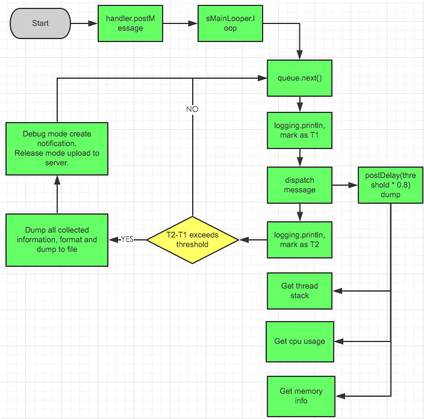

# TikTok Android App Reliability Framework Recommendations
**by [Jinlin Xu]**

# 1 Overview

The primary goal of the reliability framework is to enhance the TikTok Android app's reliability by addressing the following issues:
- General app issues such as crashes, ANRs, performance challenges, memory management issues, and system event-related problems (e.g., network changes, battery events).
- TikTok-specific issues (to be defined) such as time spent and battery usage when a specific button is clicked or a task is performed.
- Ensure the reliability, monitoring, alerting, identification, and location of issues while maintaining the overall quality of the TikTok app throughout its lifecycle, including the stages of development, testing, app publishing, release, and upgrade.

As a result of the framework, it can help us minimize issues during app release and facilitate quick updates through module-based delivery.
The flexibility of this reliability framework allows for potential extension to different operating systems, providing a versatile solution for enhancing app reliability across diverse platforms.

# 2 Requirement Analysis

## 2.1 Functional Requirements

### 2.1.1 Tiktok Reliability Client

- **Identify Issues:**
  - Develop functionality to identify issues within the TikTok app. 
  
- **Issue Collection:**
  - Implement a mechanism to collect issues, including call stack information, from the suite of automated/manual tests in the global QA and development teams.
  
- **Data Transfer:**
  - Enable the transfer of necessary issue information to the Tiktok Reliability Server, with user consent.
  
- **Integration Interface:**
  - Develop an interface for the QA team to seamlessly integrate the Tiktok Reliability Client into their automation test cases.

### 2.1.2 On-Demand Modules

  - Create on-demand modules to allow independent upgrading of specific modules without impacting the entire app.

### 2.1.3 Tiktok Reliability Server

- **Issue Collection:**
  - Develop the capability to collect issues from devices with the TikTok app installed.

- **Reliability Dashboard:**
  - Provide a reliability dashboard for the development/QA team to assess the performance of the TikTok app.

- **Monitoring & Alerting Service:**
  - Implement a monitoring and alerting service for the development/QA team to identify, locate, and resolve issues efficiently.

## 2.2 Non-Functional Requirements

### 2.2.1 Scalability

- **Issue Collection:**
  - Ensure the system can scale to collect issues from a billion devices.

### 2.2.2 Performance

- **Impact on TikTok App:**
  - Minimize the performance impact on the TikTok app during issue collection. If no issues are detected, ensure zero impact.

### 2.2.3 Security

- **Access Control:**
  - Implement robust access control mechanisms to restrict system usage to authorized personnel only.

# 3 Existing Reliabilty Systems

## 3.1 Android Vitals

Android Vitals is an integral part of the Android operating system, providing essential tools to seamlessly monitor and analyze app performance. Key features include:

- Data Collection Mechanism: Android Vitals components collect vital issue (crashes, ANRs, and system-level event issue) directly from users' devices, ensuring minimal impact on app runtime.
- Comprehensive Dashboard: The Android Vitals console offers a user-friendly dashboard for developers to assess and enhance the overall app quality and user experience.
- Playstore Reporting Rest API: Developers can leverage the Playstore Reporting Rest API to collect detailed app quality data from Android Vitals.

## 3.2 Firebase Crashlytics

Firebase Crashlytics is a reporting tool simiar as Android Vista. It only focuses on crash issues. Key features include:

- Data Collection Mechanism: Firebase Crashlytics collects crashes issue directly from users' devices, ensuring minimal impact on app runtime.
- Crash Reporting: Identifies and reports crashes, providing detailed information about each occurrence.
- Real-time Monitoring and Alerts: Enables immediate awareness of new crash occurrences and triggers alerts when the crash count reaches a defined threshold.
- Comprehensive Dashboard: Offers a user-friendly dashboard for developers, accessible both in Play Store and Firebase, to analyze and manage crash data effectively.


## 3.3 Perfetto and Systrace
Perfetto and Systrace are performance analysis tools that provide insights into the system-level behavior of Android apps. They are primarily used as performance profiling and debugging tools during the development phase. They are not intended for continuous monitoring in a production environment.  Key features include:

- Trace Collection: Capture detailed system event traces for performance optimization.
- System-Level Monitoring: Focus on CPU usage, memory management, and graphic rendering metrics.
- Real-time Analysis: Conduct real-time performance analysis for quick optimizations.
- Android Studio Integration: Seamlessly integrate with Android Studio for efficient debugging.
- Visualizations: Provide comprehensive visualizations of system-level events for easy issue identification and improvement areas."

## 3.4 Android Studio Profiler

Android Studio Profiler is a powerful performance analysis tool integrated into the Android Studio IDE and therefore can only be used at development time. Key features include:

- Real-time Monitoring: Track CPU, memory, and network usage in real-time during app execution.
- Advanced Profiling: Dive into detailed performance data, including method traces and network activity.
- Resource Allocation: Identify resource-intensive operations impacting app performance.
- Energy Profiling: Analyze energy consumption to optimize battery efficiency.
- Seamless Integration: Integrated directly into Android Studio for convenient performance analysis and debugging.

# 4 TikTok Android App Reliability Framework Analysis

## 4.1 Motivation

The TikTok Android App Reliability Framework is driven by the following key motivations:

- **Early Issue Detection and Resolution**

Supports the early detection, location, and resolution of issues during the development, testing, and release phases, ensuring that potential issues are identified and addressed at the earliest stages of the app lifecycle.

- **Quick Issue Identification for Admin and Developers**

Helps administrators and developers by providing them with a comprehensive set of tools, insights, and alert mechanisms to become the first responders to identified issues. This includes, but is not limited to:

  - **Real-time Alerts:** Provides real-time alerts through various channels such as email and phone calls, ensuring that administrators and developers are promptly notified of identified issues.

  - **Issue Tracking Records:** An integrated issue tracking system will record and manage identified issues, enabling a structured and traceable process for issue resolution.

This approach not only accelerates the issue resolution process but also enhances the overall efficiency of the development and maintenance teams by providing multiple channels for immediate awareness and response.

- **Minimizing Issues on Release**

The framework aims to minimize issues upon release, ensuring a smoother release and improved user satisfaction.

- **Module-Based Quick Upgrades**

The framework facilitates module-based quick upgrades, allowing for rapid deployment of fixes once issues have been identified and resolved. This modular approach enables targeted updates, minimizing the impact on unaffected components and ensuring a swift response to emerging challenges.

- **Support for TikTok-Specific Issues**

Provides support for identifying and resolving TikTok-specific issues occurring, offering customized solutions for optimizing performance and reliability.

## 4.2 Limitations of Existing Systems

- **Android Vitals and Firebase Crashlytics** 
  - Network Cost for billions of devices.
  - Released App focus: Their effectiveness is limited during the development phase, where dynamic and frequent analysis is crucial for identifying and addressing issues promptly.
  - These tools may not include the vital information that TikTok needs.

- **Perfetto, Systrace, and Android Studio Profiler**
  - Single device only. These tools are primarily intended for debugging and performance analysis during the development phase.

## 4.3 Conclusion

Considering TikTok's specific requirements and motivations, the existing tools face challenges in effectively meeting these needs. As a solution, the development of a dedicated TikTok Android App Reliability Framework becomes crucial to address and overcome these challenges.

# 5 Essential Knowledge for TikTok Reliability Client Design
This section introduces the knowledge of the solutions that can be used by our design. The solutions provided in this section minimize the performance impact when there is an issue and have zero performance impact when there is no issue.

## 5.1 Android Issue Collection Solution

A common scenario for Java/Kotlin app crashes is caused by an uncaught throwable/exception, and most crashes on the native side (C/C++) are related to improper memory handling. Therefore, it is crucial to understand how the Android system collects crash information in both Java/Native environments. The following diagram shows the main workflow related to this topic:


Let's explain the diagram:
- **Java/Kotlin based Components (App and System Server) Crash Handling:**
  - **Setting Default Exception Handler:**
     The app sets a default uncaught exception handler using `Thread.setDefaultUncaughtExceptionHandler(new KillApplicationHandler())`. This handler, implemented in `KillApplicationHandler.uncaughtException()`, deals with uncaught exceptions in any thread.

  - **Requesting AMS for Exception Handling:**
    If an uncaught exception occurs, the app calls ActivityManagerService (AMS) to handle it through `handleApplicationCrash()`.

  - **AMS Crash Handling:**
    AMS collects crash information using `handleApplicationCrashInner()` and sends it to DropBoxManagerService. The data is stored in a crash log file at `/data/system/dropbox`.

  - **DropBoxManagerService Log Creation:**
    DropBoxManagerService receives crash information from AMS and creates a crash log file in the `/data/system/dropbox` folder.

  - **App Self-Termination:**
   The app takes necessary actions to terminate itself.

- **Native Components (JNI and Daemon) Memory Issue and Crash Handling:**
  - **Signal Issuing:**
    Any crash in native components triggers a signal from the following list in Android:
    - SIGABRT (Abort)
    - SIGBUS (Bus Error)
    - SIGFPE (Floating Point Exception)
    - SIGILL (Illegal Instruction)
    - SIGSEGV (Segmentation Fault)
    - SIGSTKFLT (Stack Fault)
  - **Runtime Environment Setup:**
    - Android loads liblinker, debugged library, and [libAsan](https://developer.android.com/ndk/guides/gwp-asan) at the app's start to enhance debugging and analysis capabilities during runtime.
    - *liblinker:* Responsible for dynamic linking, loading, and unloading of shared libraries.
    - *Debugged Library:* Provides additional debugging information for identifying and resolving issues during runtime.
    - *libAsan (Android 8.1+):* A memory error detector tool identifying issues like buffer overflows, use-after-free, and memory corruptions.
  - **ASan Issue or Crash Handling Workflow:**
    - Triggering Crash Issue Handling: Kernel or ASan triggers a crash signal, invoking `debuggerd_signal_handler()` in the debugged library to handle crash issue information.
    - Debuggerd Dispatch Pseudo Thread: `debuggerd_signal_handler()` creates `debuggerd_dispatch_pseudo_thread`, which initiates the crashdump process, transferring crash issue information via a Pipe.
    - Log Handling: Crashdump uses UDS to send crash issue information to tombstoned daemon for logging at `/data/tombstone`. Additionally, it sends information to AMS for logging.
    - AMS Crash Handling: AMS has a NativeCrashListener thread observing crashes through a UDS socket. If it receives crash issue information from the crashdump process, it creates a NativeCrashReport thread and calls `handleApplicationCrashInner()` for further handling.
    - DropBoxManagerService Log Creation: Similar to Java code handling, the crash log is placed in the `/data/dropbox` folder.

## 5.2 App Access to Issues Log

The DropBoxManagerService handles various issues, including crashes, ANRs, and system-level events. When AMS adds an issue message to the Dropbox file, a broadcast message is sent. The following code can be used as an example of receive and process this message:

```java
public class DropBoxReceiver extends BroadcastReceiver {

    private static final String TAG = "DropBoxReceiver";

    @Override
    public void onReceive(Context context, Intent intent) {
        DropBoxManager dropBoxManager = (DropBoxManager) context.getSystemService(Context.DROPBOX);

        if (dropBoxManager != null) {
            // Get the last entry from DropBoxManager
            DropBoxManager.Entry entry = dropBoxManager.getNextEntry(null, 0);

            while (entry != null) {
                // Process the entry as needed
                String tag = entry.getTag();
                long timeMillis = entry.getTimeMillis();
                String text = entry.getText(4096); // Adjust the size as needed

                Log.d(TAG, "Received DropBox entry - Tag: " + tag + ", Time: " + timeMillis + ", Text: " + text);

                // Move to the next entry
                entry.close();
                entry = dropBoxManager.getNextEntry(tag, timeMillis);
            }
        }
    }
}
```

## 5.3 App Access to Memory Leak Issue Log

LeakCanary is a  memory leak detection library for Android, offering two main features:
- API Check: Developers can manually check any objects that are no longer needed using the provided API. The AppWatcher.objectwatch.watch() function creates a weak reference for the specified object. If this weak reference isn't cleared after a 5-second wait and garbage collection, the watched object is considered potentially leaking, and LeakCanary logs this information.

- Automatic Check: LeakCanary goes beyond manual checks by automatically detecting memory leaks in specific scenarios without requiring additional code. It achieves this by leveraging Android's lifecycle hooks. This automation is based on the understanding that the referenced objects are no longer needed after these lifecycle events.

Here is the princiapl of LeakCanary:

- ObjectWatcher and Weak References:
  
  When an attachedObject is watched using  AppWatcher.objectwatch.watch(attachedObject, description), LeakCanary creates a weak reference to that attachedObject.
- Garbage Collection and Weak References:

  After a waiting period of 5 seconds, LeakCanary triggers garbage collection. Weak references allow the associated objects to be collected during garbage collection if there are no strong references pointing to them.

- Detection of Retained Objects:

  If the weak reference held by the ObjectWatcher isn't cleared after garbage collection, it implies that the watched object has not been properly released from memory. This situation indicates a potential memory leak, as the object should have been collected if it was no longer needed.

- Logging and Identification:

  LeakCanary logs information about the retained object, including its type and any provided description. Developers can inspect these logs to identify and address the source of the memory leak.

In summary, the princiapl of LeakCanary uses weak references and garbage collection to identify objects that should have been released but are still being retained in memory. The objects could be potential memory leaks.

## 5.4  Detecting Rendering Issues

To ensure optimal performance and responsiveness in your application, it's crucial to monitor rendering issues. Analyzing the Choreographer class provides valuable insights into the rendering process. The Choreographer class exposes two key components:

- postFrameCallback (Choreographer.FrameCallback callback): Posts a frame callback to run on the next frame. The callback runs once and is automatically removed.
- Choreographer.FrameCallback#doFrame(long frameTimeNanos): Called when a new display frame is being rendered, providing the time (in nanoseconds) when the frame started rendering.

To effectively monitor frame rendering and identify potential issues, we can leverage the following code snippet. This snippet utilizes the Choreographer API to log dropped frames, obtain stack traces for all threads, and gather additional information such as CPU time and battery usage.

```c
Choreographer.getInstance().postFrameCallback(new Choreographer.FrameCallback() {
    private long lastFrameTimeNanos = 0;
    @Override
    public void doFrame(long frameTimeNanos) {
        if (lastFrameTimeNanos == 0) {
            lastFrameTimeNanos = frameTimeNanos;
            Choreographer.getInstance().postFrameCallback(this);
            return;
        }
        double diff = (frameTimeNanos - lastFrameTimeNanos) / 1000000.0;
        if (diff > 16.67) {
            int dropCount = (int) (diff / 16.7);
            if (dropCount >= 2) {
                Log.w(TAG, dropCount + " frames have been dropped. Time difference: " + diff + " ms");
                 // Obtain stack traces for all threads
                Map<Thread, StackTraceElement[]> allStackTraces = Thread.getAllStackTraces();
                
                // Log stack traces
                for (Map.Entry<Thread, StackTraceElement[]> entry : allStackTraces.entrySet()) {
                    Thread thread = entry.getKey();
                    StackTraceElement[] stackTrace = entry.getValue();
                    Log.w(TAG, "Thread: " + thread.getName());
                    for (StackTraceElement element : stackTrace) {
                        Log.w(TAG, "   " + element.toString());
                    }
                }

                // Obtain CPU time
                // Obtain Battery usage
              ...
            }
        }
        lastFrameTimeNanos = frameTimeNanos;
        Choreographer.getInstance().postFrameCallback(this);
    }
});
```
The solution provided will be adopted in our design to get rendering information. 

## 5.5  Detecting task performance Issue

### 5.5.1 Detecting UI Thread Blocking Issues
BlockCanary is a tool to detect when the UI thread is blocked for a certain period. It provides insights into the code causing the blockage, helping developers identify performance bottlenecks and optimize their applications for better responsiveness. Here is its archtecture diagram:



We can use BlockCanary principal to create our customized log class below:
```c
class LooperMonitor implements Printer {
    private static final int DEFAULT_BLOCK_THRESHOLD_MILLIS = 3000;  // time
    ...
    public LooperMonitor(BlockListener blockListener, long blockThresholdMillis, boolean stopWhenDebugging){
	...
    }

    @Override
    public void println(String x) {
        if (!mPrintingStarted) {
            mStartTimestamp = System.currentTimeMillis();
            mStartThreadTimestamp = SystemClock.currentThreadTimeMillis();
            mPrintingStarted = true;
            startDump();
        } else {
            final long endTime = System.currentTimeMillis();
            mPrintingStarted = false;
            if (isBlock(endTime)) {
                notifyBlockEvent(endTime);
            }
            stopDump();
        }
    }
    private boolean isBlock(long endTime) {
        return endTime - mStartTimestamp > mBlockThresholdMillis;
    }
}
```


### 5.5.2   Detecting Tiktok customized Issues 
Based code below: 
```c
public final class Looper {
    private Printer mLogging;
    // Used for customized Printer for logging
    public void setMessageLogging(@Nullable Printer printer) {
        mLogging = printer;
    }

    public static Looper getMainLooper() {
        ...
    }

    public static void loop() {
        final Looper me = myLooper();
   	...

        for (;;) {
            if (!loopOnce(me, ident, thresholdOverride)) {
                return;
            }
        }
    }

   private static boolean loopOnce(final Looper me,
            final long ident, final int thresholdOverride) {
        Message msg = me.mQueue.next(); // Specifically, each frame rendering involves receiving a message here
        ...
        final Printer logging = me.mLogging;
        if (logging != null) {
            logging.println(">>>>> Dispatching to " + msg.target + " "
                    + msg.callback + ": " + msg.what);
        }
        ...
        token = observer.messageDispatchStarting();
        ...

        if (logging != null) {
            logging.println("<<<<< Finished to " + msg.target + " " + msg.callback);
        }
        ...
    }
}
```
, we can override println(String x) in section 5.5.1 to parse x to get msg.target , msg.callback and msg.what that can unique identify the task for performance analysis.

# 6 TikTok Android App Reliability Framework Design

The TikTok Android App Reliability Framework Design includes key components working together to ensure the app's stability. The diagram below illustrates the interaction of important elements, such as the PlayStore Server, Android Vitals Console, TikTok Reliability Consoles for Production and Development, TikTok Reliability Server with essential services, and two devices equipped with TikTok Reliability Client and Android Vitals, one for Production, the other for development. This design aims to create a comprehensive framework for reliable app deployment, real-time monitoring, and issue resolution.


Key Components:

- **TikTok Reliability Consoles for Production and Development:**
Consoles dedicated to monitoring and managing the reliability of the TikTok app in both the production and development environments. These consoles facilitate real-time alerts, issue tracking, and overall performance assessment during the app's release and development phases. They provide tools, insights, and alert mechanisms to assist administrators and developers in addressing identified issues promptly.

- **TikTok Reliability Server:**
  The server component responsible for collecting and managing issues from devices with the TikTok app installed. It includes essential services such as ANR Service, Crash Service, Dashboard Service, Monitoring & Alerting Service, interacting with devices to ensure a seamless process.

- **TikTok Reliability Client:**
  Devices installed with TikTok Reliability Client support monitoring of the app's reliability in the production environment. They also used for finding, locating and resolving issues during the app's early stages in the development and testing phases.

- **PlayStore Server with TikTok Android App Bundle:**
  The server responsible for distributing the TikTok app to users through the Play Store. It includes the TikTok Android App Bundle, which may consist of on-demand modules for independent upgrading, contributing to a flexible and efficient app deployment process automatically.

For the purpose of this document and to manage our time effectively, we will be focusing on the design of the TikTok Reliability Client. This specific component plays a crucial role in monitoring the app's reliability in the production environment and assisting in issue identification and resolution during the app's early stages in the development and testing phases.


## 6.1  TikTok Reliability Client Design

TikTok Reliability Client is a software framework integrated with the TikTok App. It provides the following features:
- Find TikTok app issues on the device
- Collect issues from different sources
- The issue output file is used for developers to analyze; ideally, the output can be compatible with Android Profiler.
- Send the issue output file to the TikTok Reliability Server.

See design diagram below:


Key Components:
- Tiktok Reliability Manager: issue manager, issue collection from different source, create issue output file and send the issue output file to the TikTok Reliability Server.
- tiktok_signal_handler() : handle signal handle and send the native issue to the Tiktok Reliability Manager
- LeakCanary: Use the principle of LeakCanary to find possible memory in Java and send the issue to Tiktok Reliability Manager. See more information at section 5.3. 
- BlockCanary:  Use the principle  of BlockCanary to find UI thread blocking issues and send the issue to Tiktok Reliability Manager. See more information at section 5.5.1  
- Handler Collection: Use the principal of BlockCanary to find TiKtok customized Issue and send the issue to Tiktok Reliability Manager.  See more information at section 5.5.2
- Rendering Collection: use the sufaceflinger callback Choreographer#FrameCallbackdo#Frame() to find rendering Issue and send the issue to Tiktok Reliability Manager.  See more information at section 5.4.

In conclusion, the TikTok Reliability Client stands as a crucial element within our app reliability framework. Through its components, including TikTok Reliability Manager, signal handlers, and specialized collectors like LeakCanary and BlockCanary, the client actively addresses and resolves issues encountered during different stages of development. This collective effort significantly contributes to enhancing the overall stability and performance of the TikTok app.
